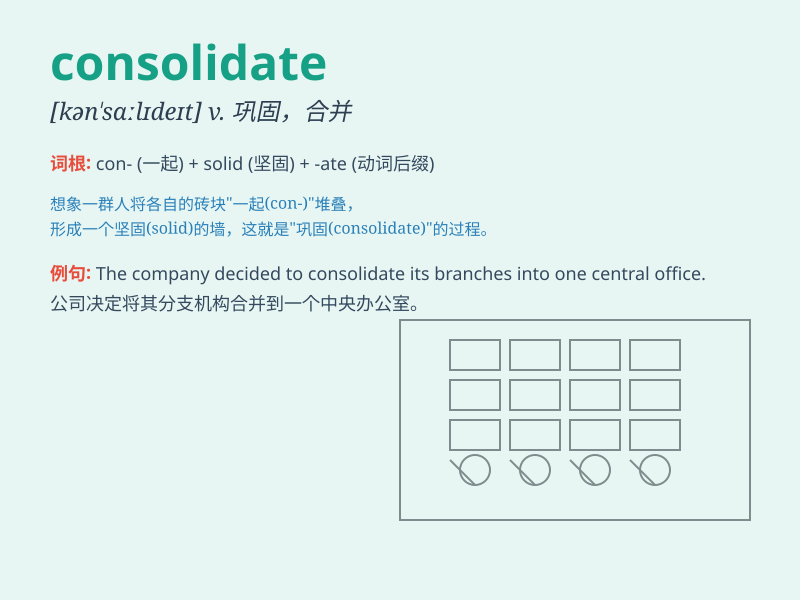

## consolidate

**英音:** _[kən\'sɒlɪdeɪt]_ **美音:** _[kən\'sɑlɪdet]_

**译义:** *v.巩固*

### 短语

+ **consolidate power:** _巩固权力_

+ **consolidate debts:** _合并债务_

+ **consolidate position:** _巩固地位_

+ **consolidate business:** _整合业务_

+ **consolidate knowledge:** _巩固知识_

### 例句

#### 例句1

> **The company is trying to consolidate its position in the
market.**

**中文翻译:** 这家公司正试图巩固其在市场中的地位。

**单词释义:** 巩固

#### 例句2

> **We need to consolidate our debts to make repayments more
manageable.**

**中文翻译:** 我们需要合并我们的债务，以使还款更易于管理。

**单词释义:** 合并

#### 例句3

> **The government is working to consolidate various laws and
regulations.**

**中文翻译:** 政府正在努力整合各种法律法规。

**单词释义:** 整合

### 背诵小故事

> A small company was struggling. But they decided to consolidate their
resources and efforts. They combined teams, shared knowledge, and
finally became strong and successful. Remember, consolidate means to
combine and strengthen.

**一家小公司举步维艰。但他们决定整合资源和努力。他们合并团队，共享知识，最终变得强大且成功。记住，consolidate
意思是合并和加强。**

### 图义

