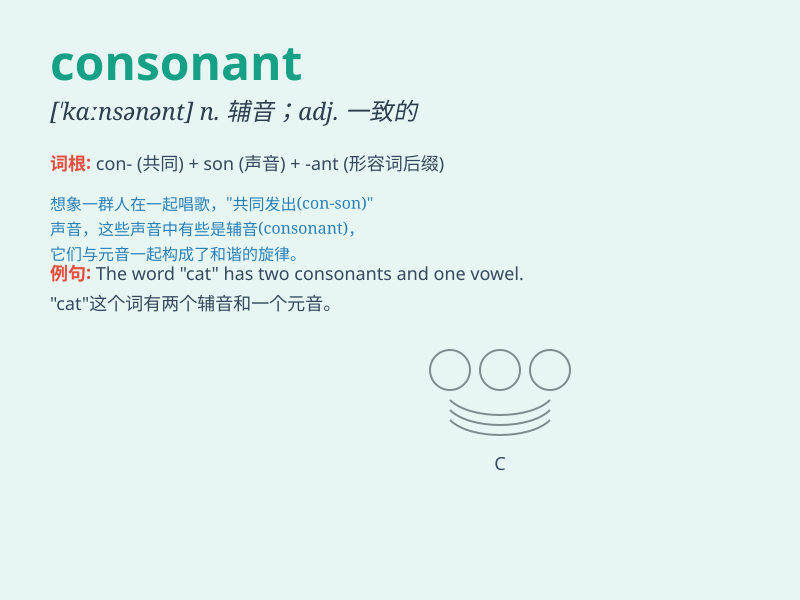

## consonant

**英音:** _[\'kɒns(ə)nənt]_ **美音:** _[\'kɑnsənənt]_

**译义:** *adj.协调一致的*

### 短语

+ **consonant cluster:** _辅音连缀_

+ **voiced consonant:** _浊辅音_

+ **consonant sound:** _辅音音素_

+ **unvoiced consonant:** _清辅音_

+ **consonant letter:** _辅音字母_

### 例句

#### 例句1

> **The word \'bat\' begins with a consonant.**

**中文翻译:** 单词 \'bat\' 以一个辅音开头。

**单词释义:** 辅音

#### 例句2

> **English has 21 consonants and 5 vowels.**

**中文翻译:** 英语有 21 个辅音和 5 个元音。

**单词释义:** 辅音

#### 例句3

> **When you pronounce this word, pay attention to the
consonants.**

**中文翻译:** 当你读这个单词时，注意辅音。

**单词释义:** 辅音

### 背诵小故事

> A little bird was singing a beautiful song. But when some consonants
like \'b\' and \'p\' joined in, the song became more complex and
interesting. The consonants added variety and charm to the melody.

**一只小鸟正在唱一首美妙的歌。但当一些辅音如'b'和'p'加入时，这首歌变得更加复杂和有趣。这些辅音给旋律增添了多样性和魅力。**

### 图义

