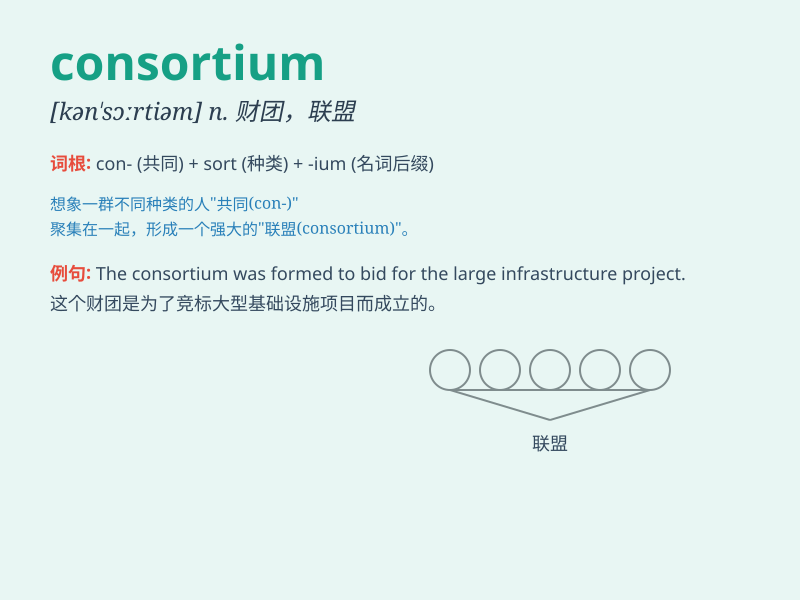

## consortium

**英音:** _[kən\'sɔːtɪəm]_ **美音:** _[kənˈsɔrtɪəm;
kənˈsɔrʃɪəm/]_

**译义:**
*n.社团,协会,联盟,(国际)财团,[律]配偶的权利,\<美>大学联盟协定*

### 短语

+ **consortium bank:** _银团银行_

+ **consortium loan:** _银团贷款_

+ **construction consortium:** _建筑财团_

+ **consortium agreement:** _财团协议_

+ **international consortium:** _国际财团_

### 例句

#### 例句1

> **The consortium of banks provided a large loan to the company.**

**中文翻译:** 这个银行财团向这家公司提供了一大笔贷款。

**单词释义:** 财团

#### 例句2

> **The construction project was carried out by a consortium of
several companies.**

**中文翻译:** 这个建筑项目是由几家公司组成的联合体来实施的。

**单词释义:** 联合体

#### 例句3

> **A consortium of scientists is conducting research on climate
change.**

**中文翻译:** 一个科学家团体正在进行关于气候变化的研究。

**单词释义:** 团体

### 背诵小故事

> 在一个神秘的小镇，有一群不同领域的专家组成了一个 consorti um
。他们携手合作，共同探索古老城堡的秘密。这个联合体拥有各种技能和知识，最终成功解开了谜团。

**在一个神秘小镇，一群不同领域专家组成了一个'联合体'。他们携手合作探索城堡秘密，这个'联合体'具备多种技能和知识，最终成功解谜。**

### 图义

