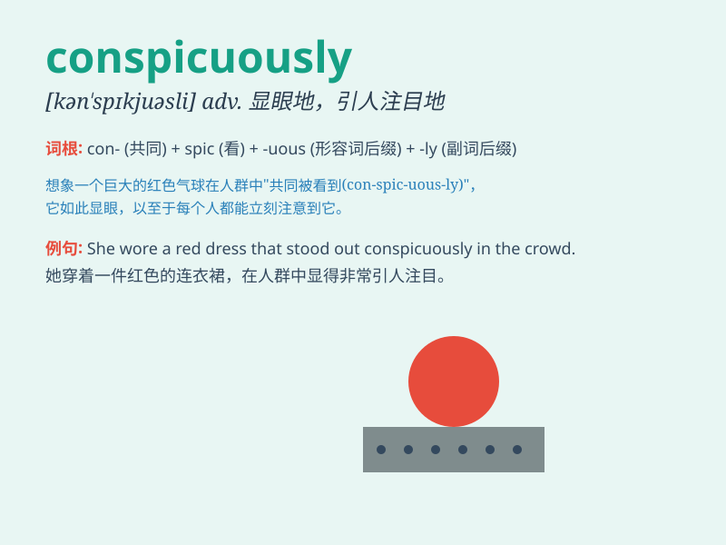

## conspicuously

**英音:** _[kən\'spɪkjuəsli]_ **美音:**
_[kən\'spɪkjuəsli]_

**译义:** *adv.显著地,超群地*

### 短语

+ **conspicuously absent:** _明显缺席_

+ **conspicuously different:** _明显不同_

+ **conspicuously displayed:** _显眼地展示_

+ **conspicuously marked:** _显著标记_

+ **conspicuously placed:** _显眼放置_

### 例句

#### 例句1

> **She was conspicuously absent from the party.**

**中文翻译:** 她明显缺席了聚会。

**单词释义:** 明显地

#### 例句2

> **The new building stands conspicuously on the hill.**

**中文翻译:** 新大楼醒目地矗立在山上。

**单词释义:** 显著地

#### 例句3

> **His mistake was conspicuously obvious.**

**中文翻译:** 他的错误明显得很。

**单词释义:** 显眼地

### 背诵小故事

> A thief was trying to steal a diamond ring conspicuously in the
jewelry store. Everyone noticed him immediately. The police arrived and
caught him easily. Being conspicuously bad leads to trouble!

**一个小偷在珠宝店里明目张胆地试图偷一枚钻石戒指。所有人立刻就注意到了他。警察赶到，轻松地抓住了他。明目张胆地作恶会带来麻烦！**

### 图义

