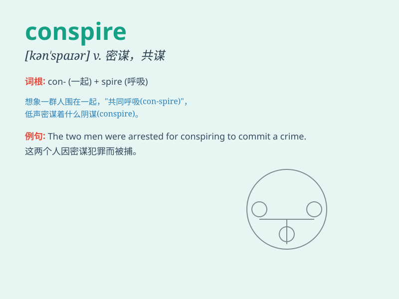

## conspire

**英音:** _[kən\'spaɪə]_ **美音:** _[kən\'spaɪɚ]_

**译义:** *v.共谋,阴谋,(指事件)凑合起来*

### 短语

+ **conspire against:** _密谋反对_

+ **conspire to do sth:** _共谋做某事_

+ **conspire with sb:** _与某人合谋_

+ **conspire in silence:** _暗中密谋_

+ **conspire together:** _共同密谋_

### 例句

#### 例句1

> **They conspired to overthrow the government.**

**中文翻译:** 他们密谋推翻政府。

**单词释义:** 密谋；共谋

#### 例句2

> **The two criminals conspired to escape from prison.**

**中文翻译:** 这两个罪犯共谋从监狱逃跑。

**单词释义:** 共谋；合谋

#### 例句3

> **The employees conspired to ask for higher wages.**

**中文翻译:** 员工们密谋要求提高工资。

**单词释义:** 密谋；暗中策划

### 背诵小故事

> Two villains, one in a black cape and the other with a mask, met
secretly in a dark alley. They whispered and planned to steal the
precious jewels. Their actions were a clear example of conspiring to
commit a crime.

**两个坏蛋，一个穿着黑色披风，另一个戴着面具，在一条黑暗的小巷里秘密会面。他们窃窃私语，计划偷取珍贵的珠宝。他们的行为明显是在合谋犯罪。**

### 图义

