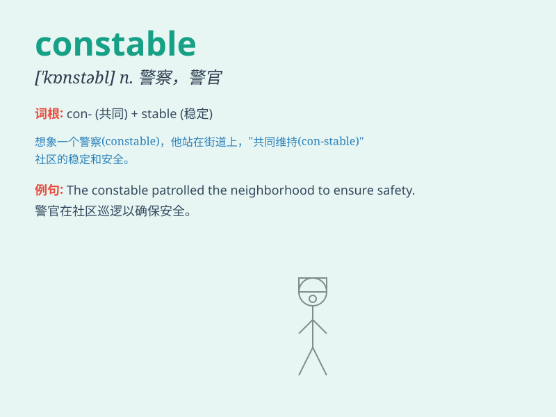

## constable

**英音:** _[\'kʌnstəb(ə)l; \'kɒn-]_ **美音:**
_[\'kɑnstəbl]_

**译义:** *n.治安官,警官,巡官*

### 短语

+ **police constable:** _警察；警员_

+ **constable duty:** _治安官职责_

+ **town constable:** _城镇治安官_

+ **constable office:** _治安官办公室_

+ **constable patrol:** _治安官巡逻_

### 例句

#### 例句1

> **The constable patrolled the neighborhood to ensure safety.**

**中文翻译:** 这位警察在社区巡逻以确保安全。

**单词释义:** 警察

#### 例句2

> **The constable was praised for his quick response in the
emergency.**

**中文翻译:** 这位警察因其在紧急情况下的快速反应而受到赞扬。

**单词释义:** 警察

#### 例句3

> **I saw the constable talking to a group of teenagers.**

**中文翻译:** 我看到警察正在和一群青少年交谈。

**单词释义:** 警察

### 背诵小故事

> 从前有个小镇，治安不太好。直到有一天来了一位勇敢的警察
constable，他日夜巡逻，守护大家。人们看到他就感到安心，因为知道有他在，小镇会变得安全。

**从前有个小镇治安差，来了一位勇敢的警察日夜巡逻守护，人们看到他就安心，因为知道小镇会因他变安全。**

### 图义

