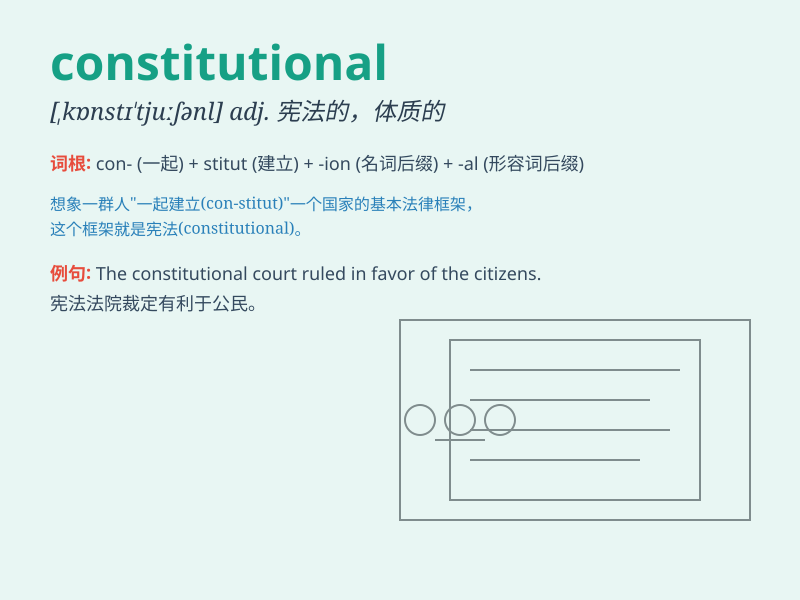

## constitutional

**英音:** _[kɒnstɪ\'tjuːʃ(ə)n(ə)l]_ **美音:**
_[,kɑnstə\'tuʃənl]_

**译义:** * /宪法*

### 短语

+ **constitutional amendment:** _宪法修正案_

+ **constitutional law:** _宪法；符合宪法的法律_

+ **constitutional monarchy:** _君主立宪制_

+ **constitutional rights:** _宪法权利_

+ **constitutional guarantee:** _宪法保障_

### 例句

#### 例句1

> **The constitutional amendment was approved by a majority vote.**

**中文翻译:** 宪法修正案以多数票获得批准。

**单词释义:** 宪法的

#### 例句2

> **He has a constitutional weakness and gets sick easily.**

**中文翻译:** 他体质虚弱，容易生病。

**单词释义:** 体质上的；生来的

#### 例句3

> **The country\'s constitutional monarchy has a long history.**

**中文翻译:** 这个国家的君主立宪制有着悠久的历史。

**单词释义:** 宪法规定的；符合宪法的

### 背诵小故事

> A king was rewriting the constitutional rules. But the people
opposed, saying it should protect their rights. So, the king had to
think carefully. \'Constitutional\' means relating to a constitution.

**一位国王正在重写宪法规则。但人民反对，称其应保护他们的权利。于是，国王不得不仔细思考。\'constitutional\'意思是与宪法有关的。**

### 图义

