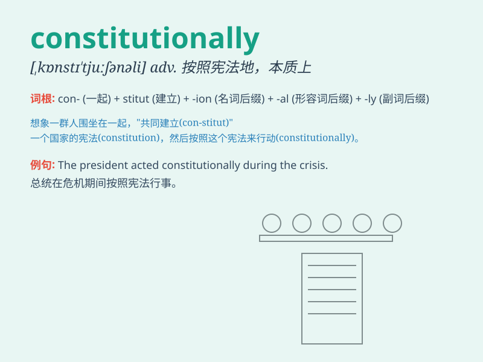

## constitutionally

**英音:** _[ˌkɒnstɪˈtjuːʃənəli]_ **美音:**
_[ˌkɑːnstɪˈtuːʃənəli]_

**译义:** *adv. 按照宪法地；本质上地；生来地*

### 短语

+ **constitutionally guaranteed:** _宪法保障的_

+ **constitutionally protected:** _受宪法保护的_

+ **constitutionally established:** _依宪法建立的_

+ **constitutionally bound:** _受宪法约束的_

+ **constitutionally empowered:** _宪法赋予权力的_

### 例句

#### 例句1

> **The law is constitutionally valid.**

**中文翻译:** 这项法律在宪法上是有效的。

**单词释义:** 在宪法上

#### 例句2

> **He is constitutionally unable to tell a lie.**

**中文翻译:** 他从本质上来说不会说谎。

**单词释义:** 本质上；天生地

#### 例句3

> **The country is constitutionally committed to protecting human
rights.**

**中文翻译:** 这个国家在宪法上致力于保护人权。

**单词释义:** 在宪法上

### 背诵小故事

> A brave citizen fought for rights constitutionally. He believed in
the power of the law and the fair system. Through peaceful protests and
legal battles, he made a difference. Constitutionally means in a way
that is based on or allowed by the constitution.

**一位勇敢的市民依法争取权利。他相信法律的力量和公平的制度。通过和平抗议和法律斗争，他发挥了作用。constitutionally
意思是依照宪法地；本质地；天生地**

### 图义

