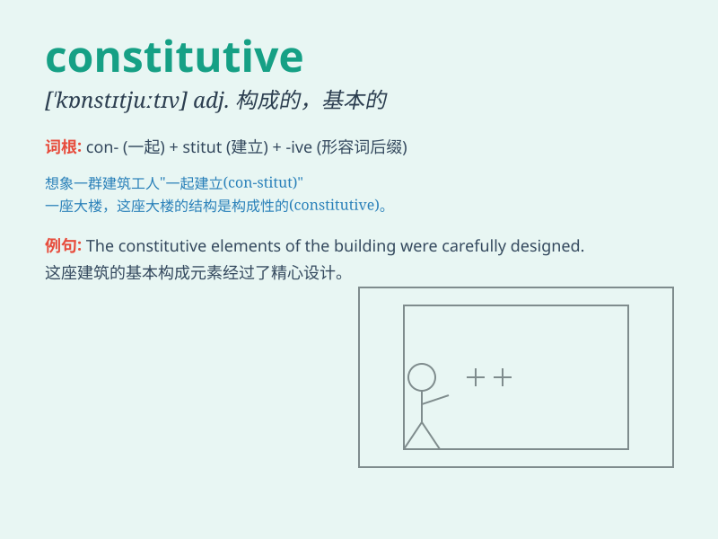

## constitutive

**英音:** _[\'kɒnstɪtjuːtɪv]_ **美音:**
_[,kɑnstə\'tutɪv]_

**译义:** *adj.构成的,制定的*

### 短语

+ **constitutive element:** _构成要素_

+ **constitutive rule:** _构成性规则_

+ **constitutive property:** _构成性质_

+ **constitutive equation:** _本构方程_

+ **constitutive relation:** _本构关系_

### 例句

#### 例句1

> **The rules are constitutive of a fair game.**

**中文翻译:** 这些规则构成了一场公平的比赛。

**单词释义:** 构成的；组成的

#### 例句2

> **Genes are constitutive elements of an organism\'s hereditary
information.**

**中文翻译:** 基因是生物体遗传信息的构成要素。

**单词释义:** 构成的；组成的

#### 例句3

> **Exercise is constitutive to good health.**

**中文翻译:** 锻炼对于良好的健康是必不可少的。

**单词释义:** 不可或缺的；必要的

### 背诵小故事

>
想象一个国家正在制定新宪法，这个过程充满了各种讨论和决策。宪法就是构成这个国家运行的基础，\'constitutive\'就像这个制定宪法的过程，意味着有构成、组成的作用。

**想象一个制定宪法的过程来辅助理解\'constitutive\'这个表示构成、组成的单词**

### 图义

