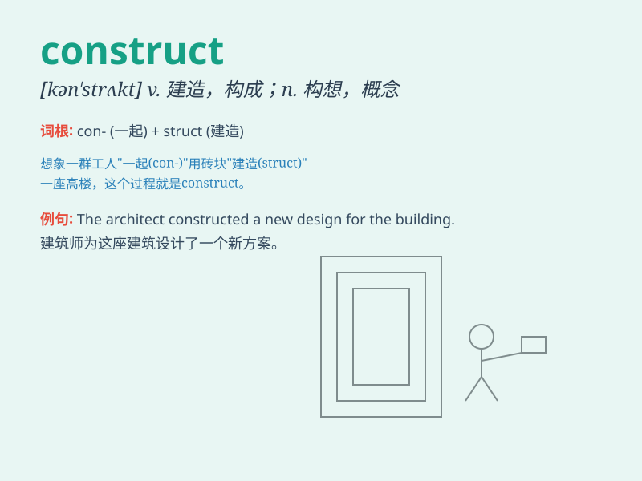

## construct

**英音:** _[kən\'strʌkt]_ **美音:** _[kən\'strʌkt]_

**译义:** *vt.建造,构造,创立*

### 短语

+ **construct a building:** _建造一栋建筑物_

+ **construct an argument:** _构建一个论点_

+ **construct a theory:** _构建一个理论_

+ **construct a model:** _构建一个模型_

+ **construct a sentence:** _构造一个句子_

### 例句

#### 例句1

> **They are planning to construct a new shopping mall.**

**中文翻译:** 他们正计划建造一个新的购物中心。

**单词释义:** 建造

#### 例句2

> **The engineer was able to construct a complex bridge.**

**中文翻译:** 这位工程师能够建造一座复杂的桥梁。

**单词释义:** 建造

#### 例句3

> **She tried to construct a logical argument to support her
point.**

**中文翻译:** 她试图构建一个合乎逻辑的论点来支持她的观点。

**单词释义:** 构建

### 背诵小故事

> A team of workers wanted to construct a big house. They brought lots
of materials and worked hard every day. Finally, the beautiful house was
constructed.

**一组工人想要建造一座大房子。他们带来了很多材料，每天都努力工作。最后，这座漂亮的房子建成了。**

### 图义

