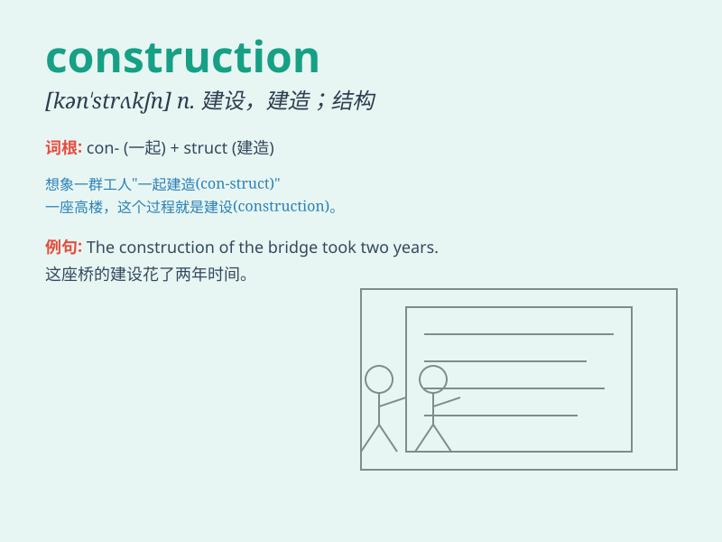

## construction

**英音:** _[kən\'strʌkʃ(ə)n]_ **美音:**
_[kən\'strʌkʃən]_

**译义:** *n.建筑,建筑物,解释,造句*

### 短语

+ **construction site:** _建筑工地_

+ **construction industry:** _建筑行业_

+ **under construction:** _在建设中_

+ **construction project:** _建设项目_

+ **construction materials:** _建筑材料_

### 例句

#### 例句1

> **The construction of the new bridge will take two years.**

**中文翻译:** 新桥梁的建设将需要两年时间。

**单词释义:** 建设；建造

#### 例句2

> **The building is of modern construction.**

**中文翻译:** 这座建筑是现代结构的。

**单词释义:** 结构；构造

#### 例句3

> **The company is in the construction business.**

**中文翻译:** 这家公司从事建筑行业。

**单词释义:** 建筑业

### 背诵小故事

> A group of ants were working hard on a construction project. They
were carrying small pieces of wood and stones to build a new home. It
was a complex construction but they were determined.

**一群蚂蚁正在努力进行一个建筑工程。它们搬运着小块的木头和石头来建造一个新家。这是一个复杂的建造工程，但它们意志坚定。**

### 图义

