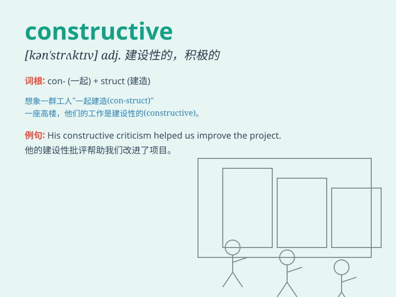

## constructive

**英音:** _[kən\'strʌktɪv]_ **美音:** _[kən\'strʌktɪv]_

**译义:** *adj.建设性的*

### 短语

+ **constructive criticism:** _建设性的批评_

+ **constructive feedback:** _建设性的反馈_

+ **constructive dialogue:** _建设性的对话_

+ **constructive approach:** _建设性的方法_

+ **constructive activity:** _建设性的活动_

### 例句

#### 例句1

> **The meeting was very constructive and we came up with several
solutions.**

**中文翻译:** 这次会议非常有建设性，我们想出了几个解决方案。

**单词释义:** 有建设性的

#### 例句2

> **His constructive criticism helped me improve my work.**

**中文翻译:** 他建设性的批评帮助我改进了我的工作。

**单词释义:** 建设性的

#### 例句3

> **We need to have a more constructive attitude towards this
problem.**

**中文翻译:** 对于这个问题，我们需要有一个更具建设性的态度。

**单词释义:** 建设性的

### 背诵小故事

> A team was working on a project. But they faced many problems. Then
came a wise leader with constructive ideas. He suggested new methods,
and finally the project succeeded. The leader\'s suggestions were truly
constructive.

**一个团队正在做一个项目。但他们面临很多问题。这时来了一位明智的领导，带着有建设性的想法。他提出新方法，最终项目成功了。这位领导的建议真的是有建设性的。**

### 图义

