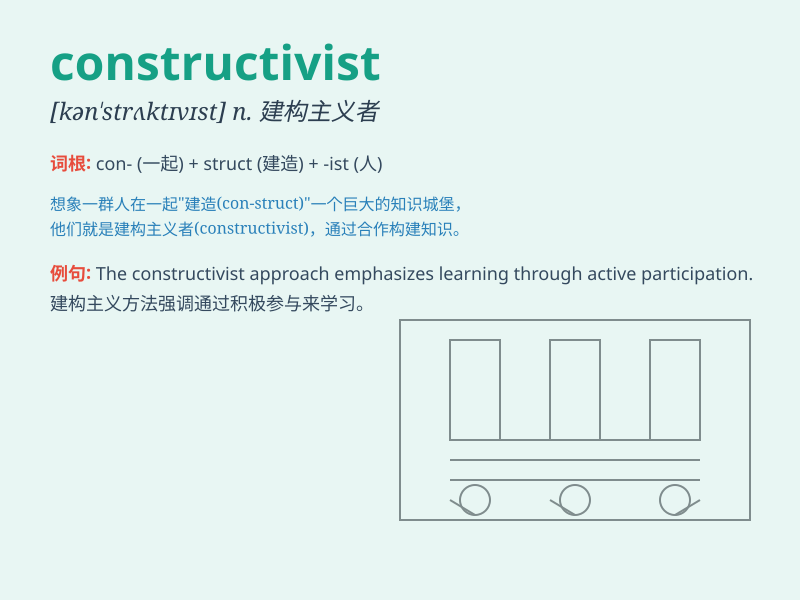

## constructivist

**英音:** _[kənˈstrʌktɪvɪst]_ **美音:**
_[kənˈstrʌktɪvɪst]_

**译义:** *n.构成主义者*

### 短语

+ **constructivist approach:** _建构主义方法_

+ **constructivist learning:** _建构主义学习_

+ **constructivist theory:** _建构主义理论_

+ **social constructivist:** _社会建构主义者_

+ **constructivist perspective:** _建构主义视角_

### 例句

#### 例句1

> **The constructivist approach emphasizes the active role of
learners in constructing knowledge.**

**中文翻译:** 建构主义方法强调学习者在构建知识方面的积极作用。

**单词释义:** 建构主义的

#### 例句2

> **She is a prominent constructivist in the field of education.**

**中文翻译:** 她是教育领域一位杰出的建构主义者。

**单词释义:** 建构主义的

#### 例句3

> **The constructivist theory has had a significant impact on modern
teaching methods.**

**中文翻译:** 建构主义理论对现代教学方法产生了重大影响。

**单词释义:** 建构主义的

### 背诵小故事

> A group of architects were called constructivists. They aimed to
construct buildings in a new and creative way. They were always thinking
about how to make structures that were both functional and beautiful.
Remember, constructivist means related to this creative construction
approach.

**一群建筑师被称为建构主义者。他们致力于以一种新的、有创意的方式建造建筑。他们总是思考如何建造既实用又美观的建筑。记住，constructivist
意思是与这种创造性的建造方法有关。**

### 图义

