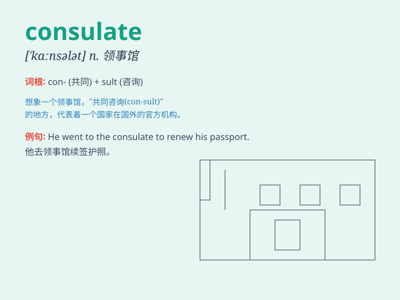

## consulate

**英音:** _[\'kɒnsjʊlət]_ **美音:** _[\'kɑnsələt]_

**译义:** *n.领事,领事馆,领事任期,领事的职位、权力和职责*

### 短语

+ **consulate general:** _总领事馆_

+ **vice consulate:** _副领事馆_

+ **honorary consulate:** _名誉领事馆_

+ **consulate staff:** _领事馆工作人员_

+ **consulate building:** _领事馆大楼_

### 例句

#### 例句1

> **I lost my passport and went to the consulate for help.**

**中文翻译:** 我丢失了护照，去领事馆寻求帮助。

**单词释义:** 领事馆

#### 例句2

> **The consulate issued a travel warning for the region.**

**中文翻译:** 领事馆发布了该地区的旅行警告。

**单词释义:** 领事馆

#### 例句3

> **He works at the American consulate in Shanghai.**

**中文翻译:** 他在美国驻上海领事馆工作。

**单词释义:** 领事馆

### 背诵小故事

> A brave adventurer lost his passport in a foreign country. He rushed
to the consulate for help. The staff at the consulate were friendly and
efficient, quickly solving his problem.

**一位勇敢的冒险家在外国丢失了护照。他匆忙赶到领事馆寻求帮助。领事馆的工作人员友好且高效，很快解决了他的问题。**

### 图义

