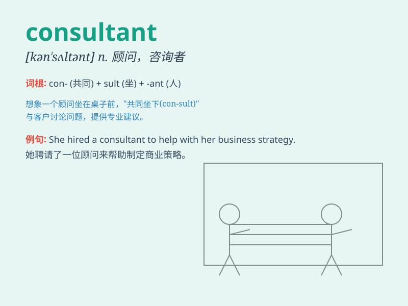

## consultant

**英音:** _[kən\'sʌlt(ə)nt]_ **美音:** _[kən\'sʌltənt]_

**译义:** *n.顾问,商议者,咨询者*

### 短语

+ **management consultant:** _管理顾问_

+ **financial consultant:** _财务顾问_

+ **marketing consultant:** _营销顾问_

+ **IT consultant:** _信息技术顾问_

+ **consultant firm:** _咨询公司_

### 例句

#### 例句1

> **The company hired a marketing consultant to improve its brand
image.**

**中文翻译:** 这家公司聘请了一位营销顾问来改善其品牌形象。

**单词释义:** 顾问

#### 例句2

> **She works as a financial consultant for several major banks.**

**中文翻译:** 她为几家大银行担任金融顾问。

**单词释义:** 顾问

#### 例句3

> **The consultant provided valuable advice on our project.**

**中文翻译:** 这位顾问为我们的项目提供了宝贵的建议。

**单词释义:** 顾问

### 背诵小故事

>
想象一个小镇，人们遇到难题不知如何解决。这时，一位聪明的专家出现了，大家都向他请教。这位专家就是
consultant ，专门提供专业意见和解决问题的方案。

**想象一个小镇，人们遇到难题不知如何解决。这时，一位聪明的专家出现了，大家都向他请教。这位专家就是"顾问；咨询者"，专门提供专业意见和解决问题的方案。**

### 图义

