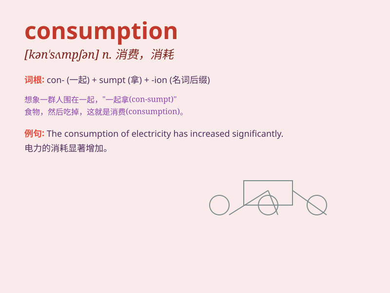

## consumption

**英音:** _[kən\'sʌm(p)ʃ(ə)n]_ **美音:**
_[kən\'sʌmpʃən]_

**译义:** *n.消费,消费量,肺病*

### 短语

+ **domestic consumption:** _国内消费_

+ **energy consumption:** _能源消耗_

+ **consumption pattern:** _消费模式_

+ **consumption tax:** _消费税_

+ **low consumption:** _低消耗_

### 例句

#### 例句1

> **The consumption of fossil fuels is a major environmental
concern.**

**中文翻译:** 化石燃料的消耗是一个主要的环境问题。

**单词释义:** 消耗

#### 例句2

> **The doctor advised him to reduce his sugar consumption.**

**中文翻译:** 医生建议他减少糖的摄入量。

**单词释义:** 摄入量

#### 例句3

> **Consumption of alcohol is prohibited in this area.**

**中文翻译:** 在这个地区饮酒是被禁止的。

**单词释义:** 消费

### 背诵小故事

> A king was very worried about the consumption of food in his kingdom.
He ordered a count and found that too much was being used. So, he made
new rules to control it. \'Consumption\' here means the using up of
something.

**一位国王非常担心他王国里食物的消耗。他下令统计，发现使用得太多了。于是，他制定了新的规则来控制。这里的'consumption'意思是某物的消耗、用尽。**

### 图义

