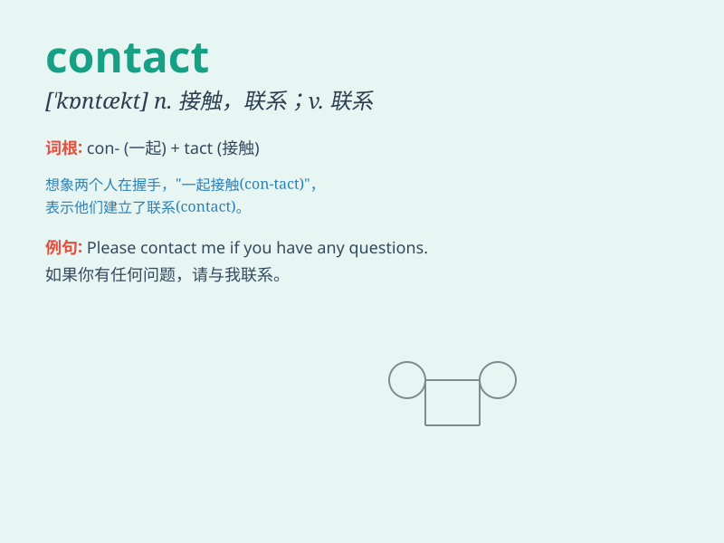

## contact

**英音:** _[\'kɒntækt]_ **美音:** _[\'kɑntækt]_

**译义:** *n.接触,联系vt.接触,联系*

### 短语

+ **contact lens:** _隐形眼镜_

+ **make contact:** _进行接触；取得联系_

+ **eye contact:** _目光接触；眼神交流_

+ **contact information:** _联系信息；联络资料_

+ **come into contact with:** _与\...接触；与\...联系_

### 例句

#### 例句1

> **I need to contact my lawyer.**

**中文翻译:** 我需要联系我的律师。

**单词释义:** 联系

#### 例句2

> **The virus can be transmitted through direct contact.**

**中文翻译:** 这种病毒可以通过直接接触传播。

**单词释义:** 接触

#### 例句3

> **Please keep in contact with me.**

**中文翻译:** 请与我保持联系。

**单词释义:** 联系

### 背诵小故事

> One day, I lost my phone and needed to contact my friends. I searched
everywhere but couldn\'t find it. Finally, I borrowed a stranger\'s
phone to contact them and got help.

**有一天，我弄丢了手机，需要联系我的朋友们。我到处找但都没找到。最后，我借了一个陌生人的手机来联系他们并得到了帮助。**

### 图义

