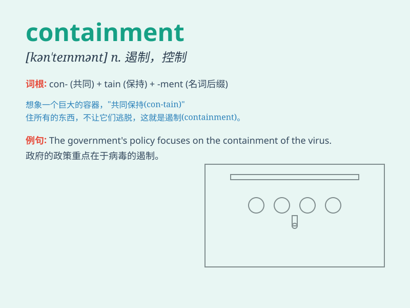

## containment

**英音:** _[kən\'teɪnm(ə)nt]_ **美音:** _[kən\'tenmənt]_

**译义:** *n.围堵政策,牵制政策*

### 短语

+ **containment policy:** _遏制政策_

+ **containment strategy:** _遏制战略_

+ **containment measure:** _遏制措施_

+ **containment vessel:** _安全壳；密封容器_

+ **containment system:** _遏制系统；防护系统_

### 例句

#### 例句1

> **The containment of the virus is our top priority.**

**中文翻译:** 遏制病毒是我们的首要任务。

**单词释义:** 遏制；控制

#### 例句2

> **The containment measures have been effective so far.**

**中文翻译:** 到目前为止，控制措施一直是有效的。

**单词释义:** 控制手段；遏制措施

#### 例句3

> **They are working on the containment of the oil spill.**

**中文翻译:** 他们正在努力控制石油泄漏。

**单词释义:** 控制；抑制

### 背诵小故事

> In a post-apocalyptic world, a team was working hard on containment
measures to stop the spread of a dangerous virus. They built walls and
set up checkpoints to achieve containment.

**在一个末日之后的世界里，一个团队正在努力采取遏制措施来阻止一种危险病毒的传播。他们建造围墙和设立检查站以实现遏制。**

### 图义

