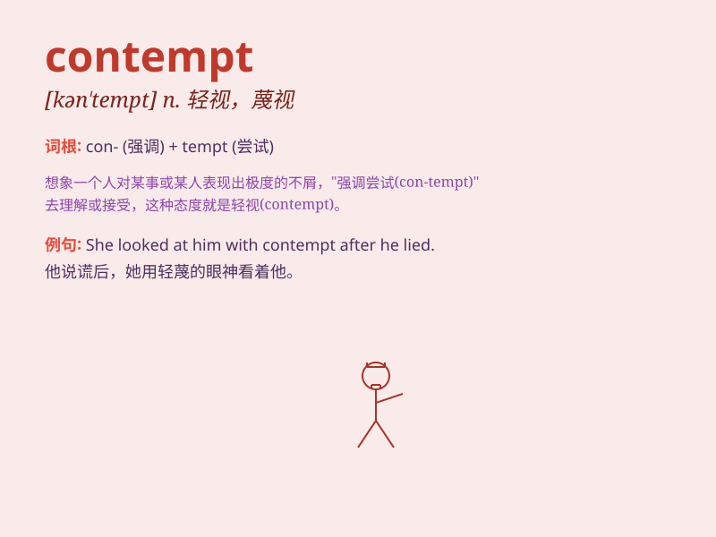

## contempt

**英音:** _[kən\'tem(p)t]_ **美音:** _[kən\'tɛmpt]_

**译义:** *n.轻视,轻蔑,耻辱,不尊敬,[律]藐视法庭(或国会)*

### 短语

+ **in contempt of:** _不顾；不把...放在眼里；藐视_

+ **hold in contempt:** _轻视；瞧不起_

+ **beneath contempt:** _极为可鄙；不屑一顾_

+ **contempt for:** _对...的蔑视_

+ **show contempt:** _表现出轻蔑_

### 例句

#### 例句1

> **He looked at her with contempt.**

**中文翻译:** 他轻蔑地看着她。

**单词释义:** 轻蔑；轻视

#### 例句2

> **The judge showed contempt for the defendant\'s lies.**

**中文翻译:** 法官对被告的谎言表示蔑视。

**单词释义:** 蔑视

#### 例句3

> **She was filled with contempt for those who had betrayed her.**

**中文翻译:** 她对那些背叛她的人充满了轻蔑。

**单词释义:** 轻蔑

### 背诵小故事

> A thief was caught stealing again. The judge showed contempt on his
face, as this was not the thief\'s first crime. The thief felt very
ashamed. \'Contempt\' means the feeling of despising someone or
something.

**一个小偷再次行窃被抓。法官脸上露出轻蔑，因为这不是这个小偷第一次犯罪了。小偷感到非常羞愧。\'contempt\'意思是轻视、蔑视某人或某事的感觉。**

### 图义

