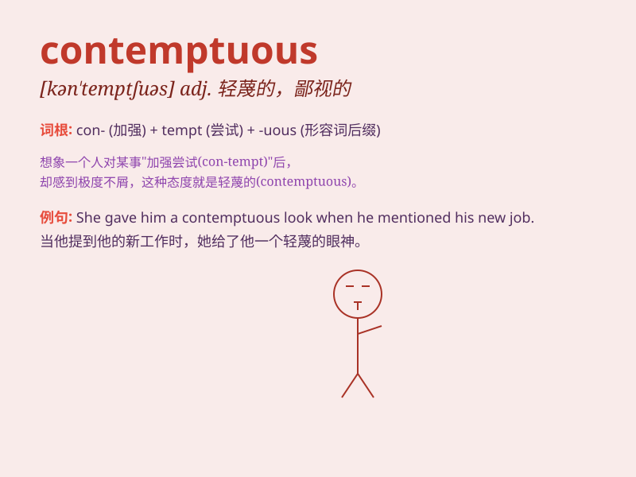

## contemptuous

**英音:** _[kən\'tem(p)tjʊəs]_ **美音:**
_[kən\'tɛmptʃuəs]_

**译义:** *adj.轻蔑的,侮辱的*

### 短语

+ **contemptuous look:** _轻蔑的表情_

+ **contemptuous attitude:** _轻蔑的态度_

+ **contemptuous smile:** _轻蔑的微笑_

+ **contemptuous tone:** _轻蔑的语气_

+ **contemptuous laughter:** _轻蔑的笑声_

### 例句

#### 例句1

> **He gave a contemptuous laugh at my suggestion.**

**中文翻译:** 他对我的建议轻蔑地笑了笑。

**单词释义:** 轻蔑的，鄙视的

#### 例句2

> **The contemptuous look in her eyes was hard to miss.**

**中文翻译:** 她眼中那轻蔑的神情很难被忽视。

**单词释义:** 轻蔑的，轻视的

#### 例句3

> **His contemptuous attitude towards his colleagues caused a lot of
problems.**

**中文翻译:** 他对同事轻蔑的态度引发了很多问题。

**单词释义:** 轻蔑的，不屑一顾的

### 背诵小故事

> A king was very contemptuous of a poor peasant. He looked down on the
peasant with a sneer. But in the end, the peasant\'s wisdom saved the
kingdom, making the king regret his contemptuous attitude.

**一位国王对一个贫穷的农民非常轻蔑。他带着嘲笑轻视农民。但最后，农民的智慧拯救了王国，让国王为他轻蔑的态度感到后悔。**

### 图义

