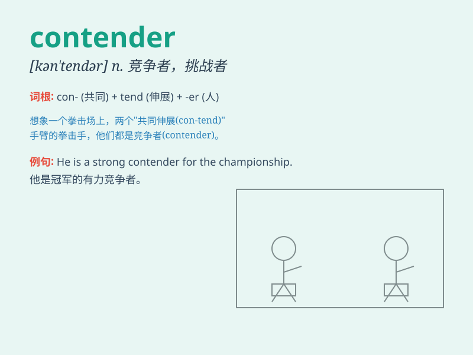

## contender

**英音:** _[kənˈtendə(r)]_ **美音:** _[kənˈtendər]_

**译义:** * 斗争者,竞争者*

### 短语

+ **strong contender:** _强有力的竞争者_

+ **leading contender:** _领先的竞争者_

+ **serious contender:** _严肃的竞争者；认真的竞争者_

+ **potential contender:** _潜在的竞争者_

+ **contender for sth:** _某物的竞争者_

### 例句

#### 例句1

> **He is a strong contender for the championship.**

**中文翻译:** 他是冠军的有力竞争者。

**单词释义:** 竞争者

#### 例句2

> **The young boxer emerged as a serious contender in the ring.**

**中文翻译:** 这位年轻的拳击手在拳台上成为了一名重要的竞争者。

**单词释义:** 竞争者

#### 例句3

> **There are several contenders vying for the top position in the
company.**

**中文翻译:** 有几个竞争者在争夺公司的最高职位。

**单词释义:** 竞争者

### 背诵小故事

> In a fierce boxing match, there were many strong fighters. One of
them was a determined young man who aimed to become the champion. He was
a contender, constantly training and fighting hard to prove himself.

**在一场激烈的拳击比赛中，有许多强壮的选手。其中有一个坚定的年轻人，他立志成为冠军。他是一名竞争者，不断训练并努力战斗以证明自己。**

### 图义

