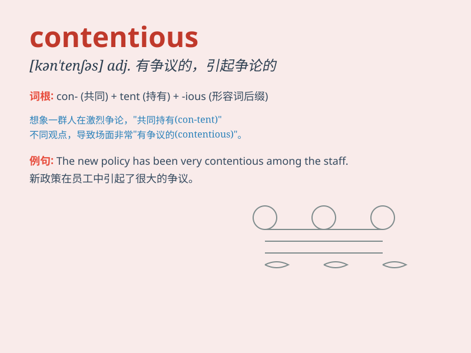

## contentious

**英音:** _[kən\'tenʃəs]_ **美音:** _[kənˈtenʃəs]_

**译义:** *adj.好争吵的,争论的,有异议的*

### 短语

+ **contentious issue:** _有争议的问题_

+ **contentious matter:** _有争议的事情_

+ **contentious debate:** _激烈的辩论_

+ **contentious election:** _有争议的选举_

+ **contentious relationship:** _充满争议的关系_

### 例句

#### 例句1

> **The meeting became contentious when the budget was discussed.**

**中文翻译:** 当讨论预算时，会议变得有争议。

**单词释义:** 引起争论的；有争议的

#### 例句2

> **The contentious issue of immigration reform has divided the
country.**

**中文翻译:** 移民改革这个有争议的问题使这个国家产生了分歧。

**单词释义:** 引起争论的；有争议的

#### 例句3

> **Their relationship was often contentious, with frequent
arguments.**

**中文翻译:** 他们的关系经常充满争议，常有争吵。

**单词释义:** 好争论的；爱争吵的

### 背诵小故事

> A group of friends were arguing over which movie to watch. It was a
contentious situation as everyone had strong opinions. They shouted and
refused to back down. Finally, they decided to take turns choosing.

**一群朋友在争论看哪部电影。这是一个有争议的情况，因为每个人都有强烈的意见。他们大喊大叫，不肯让步。最后，他们决定轮流选择。**

### 图义

