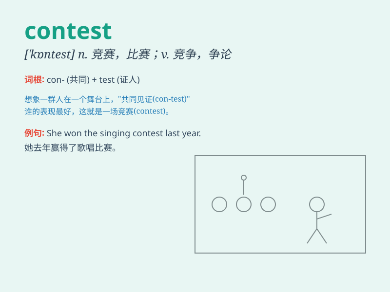

## contest

**英音:** _[\'kɒntest]_ **美音:** _[kən\'tɛst]_

**译义:** *n.论争,竞赛v.,争论,争辩,竞赛,争夺*

### 短语

+ **enter a contest:** _参加竞赛_

+ **win a contest:** _赢得竞赛_

+ **contest rules:** _竞赛规则_

+ **speech contest:** _演讲比赛_

+ **beauty contest:** _选美比赛_

### 例句

#### 例句1

> **She decided to contest the election.**

**中文翻译:** 她决定参加竞选。

**单词释义:** 参加（竞争或选举）

#### 例句2

> **The outcome of the contest was very close.**

**中文翻译:** 这场竞赛的结果非常接近。

**单词释义:** 竞赛；比赛

#### 例句3

> **He contested the court\'s decision.**

**中文翻译:** 他对法院的判决提出异议。

**单词释义:** 对\...\...提出质疑；争论

### 背诵小故事

> In a big city, there was a fierce contest to find the best singer.
Many people participated, singing their hearts out. Finally, the winner
was decided based on the audience\'s votes. \'Contest\' means a
competition or struggle.

**在一个大城市里，有一场激烈的寻找最佳歌手的竞赛。许多人参加，尽情歌唱。最终，根据观众的投票决出了获胜者。\'contest\'意思是竞赛或争夺。**

### 图义

