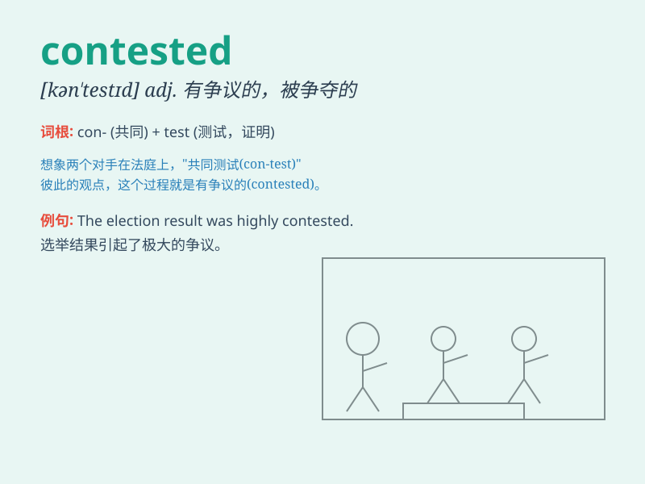

## contested

**英音:** _[kənˈtestɪd]_ **美音:** _[kənˈtestɪd]_

**译义:** *adj. 有争议的；引起争论的；v.
竞争；争辩；对......提出异议（contest 的过去分词）*

### 短语

+ **contested election:** _有争议的选举_

+ **contested territory:** _有争议的领土_

+ **contested issue:** _有争议的问题_

+ **contested divorce:** _有争议的离婚_

+ **contested point:** _有争议的观点_

### 例句

#### 例句1

> **The contested election results led to widespread protests.**

**中文翻译:** 有争议的选举结果导致了广泛的抗议。

**单词释义:** 有争议的

#### 例句2

> **The contested territory has been a source of conflict for
years.**

**中文翻译:** 这片有争议的领土多年来一直是冲突的根源。

**单词释义:** 有争议的

#### 例句3

> **The athlete contested every point during the game.**

**中文翻译:** 这位运动员在比赛中对每一分都提出异议。

**单词释义:** 对\...提出异议

### 背诵小故事

> In a fierce sports competition, the championship was highly
contested. Two teams fought hard, each insisting they should win.
\'Contested\' here means there was a strong dispute or competition over
something.

**在一场激烈的体育比赛中，冠军头衔竞争激烈。两支队伍奋力拼搏，都坚称自己应该获胜。'contested'在这里意味着对某事存在强烈的争议或竞争。**

### 图义

