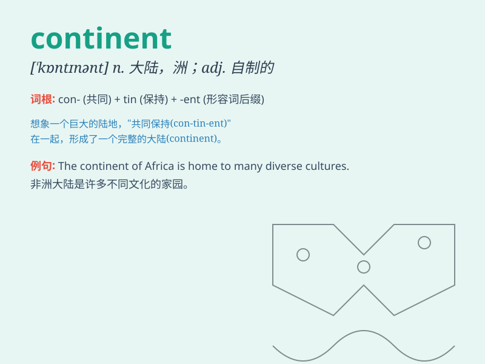

## continent

**英音:** _[\'kɒntɪnənt]_ **美音:** _[\'kɑntɪnənt]_

**译义:** *n.大陆,陆地*

### 短语

+ **continental breakfast:** _欧式早餐_

+ **continental climate:** _大陆性气候_

+ **continental drift:** _大陆漂移_

+ **continental shelf:** _大陆架_

+ **continental divide:** _大陆分水岭_

### 例句

#### 例句1

> **Asia is the largest continent in the world.**

**中文翻译:** 亚洲是世界上最大的大陆。

**单词释义:** 大陆

#### 例句2

> **The explorers crossed several continents during their
journey.**

**中文翻译:** 这些探险家在旅途中穿越了好几个大陆。

**单词释义:** 大陆

#### 例句3

> **The discovery had a significant impact on the understanding of
the continent\'s history.**

**中文翻译:** 这一发现对了解该大陆的历史有着重大影响。

**单词释义:** 大陆

### 背诵小故事

> Once upon a time, a brave explorer set out to discover new lands.
After a long journey, he finally reached a vast area of land that was
continuous and huge. This land was called a continent.

**从前，一位勇敢的探险家出发去发现新的土地。经过漫长的旅程，他终于到达了一片广阔且连续的巨大区域。这片土地被称为大陆。**

### 图义

