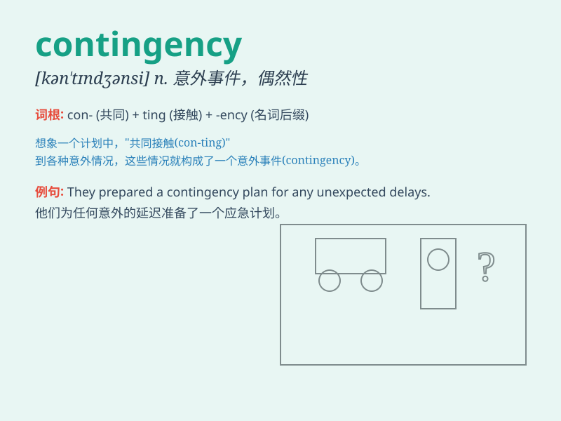

## contingency

**英音:** _[kən\'tɪndʒ(ə)nsɪ]_ **美音:**
_[kən\'tɪndʒənsi]_

**译义:** *n.偶然,可能性,意外事故,可能发生的附带事件*

### 短语

+ **contingency plan:** _应急计划；应变计划_

+ **contingency fund:** _应急基金；意外开支准备金_

+ **contingency theory:** _权变理论_

+ **contingency table:** _列联表；相依表_

+ **contingency approach:** _权变方法；应变方法_

### 例句

#### 例句1

> **We need to plan for every contingency.**

**中文翻译:** 我们需要为每一种可能发生的情况做好计划。

**单词释义:** 可能发生的事；偶发事件

#### 例句2

> **A contingency fund was set up to deal with unexpected
expenses.**

**中文翻译:** 设立了一笔应急基金来处理意外开支。

**单词释义:** 应急费用；意外开支

#### 例句3

> **The success of the project depends on many contingencies.**

**中文翻译:** 这个项目的成功取决于很多偶然因素。

**单词释义:** 偶然情况；意外事件

### 背诵小故事

> A group of explorers was on an adventure. Suddenly, they faced a
contingency - a huge storm. But they were prepared with emergency
supplies. This unexpected situation was a contingency they had thought
about before.

**一群探险家正在冒险。突然，他们遭遇了意外情况------一场巨大的风暴。但他们准备了应急物资。这种意想不到的状况就是他们之前想到过的偶然性。**

### 图义

