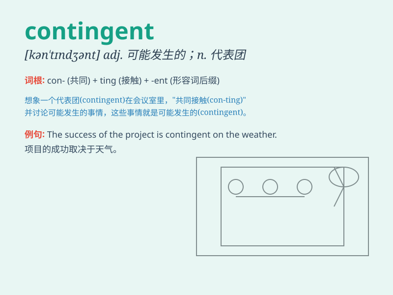

## contingent

**英音:** _[kən\'tɪndʒ(ə)nt]_ **美音:**
_[kən\'tɪndʒənt]_

**译义:** *adj.可能发生的,附随的,暂时的n.偶然的事情,分遣队*

### 短语

+ **contingent liability:** _或有负债_

+ **contingent event:** _或有事件_

+ **contingent worker:** _临时工；应急工_

+ **contingent fee:** _成功酬金；胜诉酬金_

+ **contingent upon:** _视\...而定；取决于_

### 例句

#### 例句1

> **The success of the project is contingent on obtaining sufficient
funding.**

**中文翻译:** 这个项目的成功取决于能否获得足够的资金。

**单词释义:** 取决于；依\...而定

#### 例句2

> **A contingent of soldiers was sent to the disaster area.**

**中文翻译:** 一支分遣队的士兵被派往灾区。

**单词释义:** 分遣队；小分队

#### 例句3

> **The damages were contingent upon the severity of the
accident.**

**中文翻译:** 损失取决于事故的严重程度。

**单词释义:** 依情况而定的

### 背诵小故事

> A group of tourists were on a trip. Their destination was contingent
on the weather. If it was sunny, they would go to the beach; if it
rained, they would visit the museum. So, \'contingent\' means dependent
on certain conditions.

**一群游客在旅行。他们的目的地取决于天气。如果天气晴朗，他们就去海滩；如果下雨，他们就去博物馆。所以，'contingent'意思是视某些情况而定。**

### 图义

