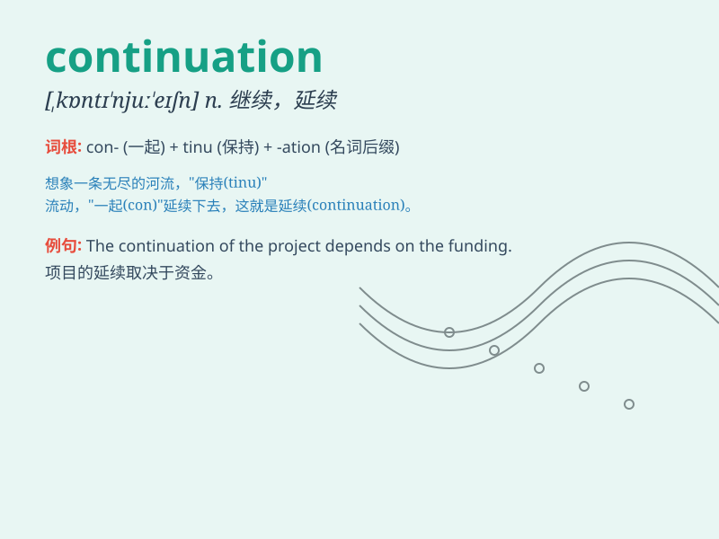

## continuation

**英音:** _[kəntɪnjʊ\'eɪʃ(ə)n]_ **美音:**
_[kən\'tɪnjʊ\'eʃən]_

**译义:**
*n.继续,续集,延长,延长物,扩建物,附加部分,(报刊等的)续刊、增刊,续篇*

### 短语

+ **continuation of:** _\...\...的延续_

+ **continuation class:** _补习班_

+ **continuation sheet:** _续页_

+ **continuation school:** _成人业余补习学校_

+ **in continuation:** _连续地_

### 例句

#### 例句1

> **The continuation of the story was even more exciting.**

**中文翻译:** 这个故事的后续甚至更加令人兴奋。

**单词释义:** 后续；延续

#### 例句2

> **We need a continuation of good weather for the outdoor event.**

**中文翻译:** 我们的户外活动需要好天气持续下去。

**单词释义:** 持续；连续

#### 例句3

> **The continuation of the road was blocked by fallen trees.**

**中文翻译:** 这条路的延续部分被倒下的树挡住了。

**单词释义:** 延续部分；续篇

### 背诵小故事

> Once upon a time, a little bird was on a long journey. After a break,
it resumed its flight. This resumption was a continuation of its
adventure. It showed that the bird was determined to reach its
destination.

**从前，一只小鸟在长途旅行。休息一阵后，它重新起飞。这次重新起飞就是它冒险旅程的继续。这表明小鸟决心抵达目的地。**

### 图义

