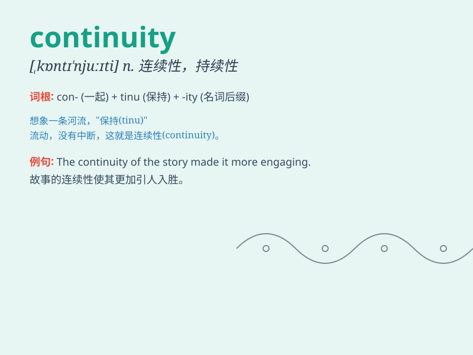

## continuity

**英音:** _[,kɒntɪ\'njuːɪtɪ]_ **美音:**
_[\'kɑntə\'nʊəti]_

**译义:** *n.连续性,连贯性*

### 短语

+ **continuity of supply:** _供应的连续性_

+ **continuity equation:** _连续性方程_

+ **business continuity:** _业务连续性_

+ **continuity planning:** _连续性规划_

+ **continuity test:** _连续性测试_

### 例句

#### 例句1

> **The continuity of the story made it very engaging.**

**中文翻译:** 这个故事的连贯性使它非常引人入胜。

**单词释义:** 连贯性

#### 例句2

> **We need to ensure the continuity of power supply during the
operation.**

**中文翻译:** 我们需要确保在操作过程中电力供应的连续性。

**单词释义:** 连续性

#### 例句3

> **The company values the continuity of its management team.**

**中文翻译:** 公司重视其管理团队的持续性。

**单词释义:** 持续性

### 背诵小故事

> A little ant was on a long journey. It never stopped, showing perfect
continuity. It kept moving forward, no matter how hard the path was.
This shows what continuity means - the state of going on without
interruption.

**一只小蚂蚁正在长途跋涉。它从未停歇，展现出了完美的连续性。无论道路多么艰难，它都一直向前移动。这就展示了continuity的意思 -
不间断持续的状态。**

### 图义

