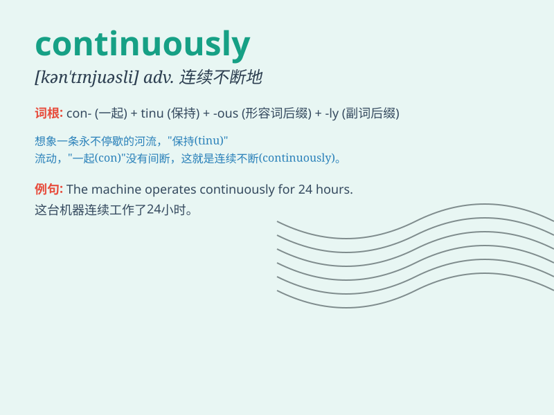

## continuously

**英音:** _[kənˈtɪnjʊəsli]_ **美音:** _[kənˈtɪnjuəsli]_

**译义:** *adv.不断地,连续地*

### 短语

+ **continuously variable:** _连续变化的_

+ **continuously improve:** _不断改进_

+ **continuously monitor:** _持续监测_

+ **continuously operate:** _连续运行_

+ **continuously develop:** _不断发展_

### 例句

#### 例句1

> **The machine has been running continuously for 24 hours.**

**中文翻译:** 这台机器已经连续运行了 24 个小时。

**单词释义:** 连续不断地

#### 例句2

> **It has been raining continuously since yesterday.**

**中文翻译:** 从昨天开始一直在不停地下雨。

**单词释义:** 不停地

#### 例句3

> **The music played continuously throughout the party.**

**中文翻译:** 音乐在整个聚会中持续播放。

**单词释义:** 持续地

### 背诵小故事

> A brave astronaut was on a mission in space. The spaceship moved
continuously without any stops, going further and further into the
unknown. It just kept going, like never-ending journey.

**一位勇敢的宇航员正在执行太空任务。宇宙飞船不停地连续移动，没有任何停顿，不断地深入未知领域。它就这样一直前进，就像一场永无止境的旅程。**

### 图义

