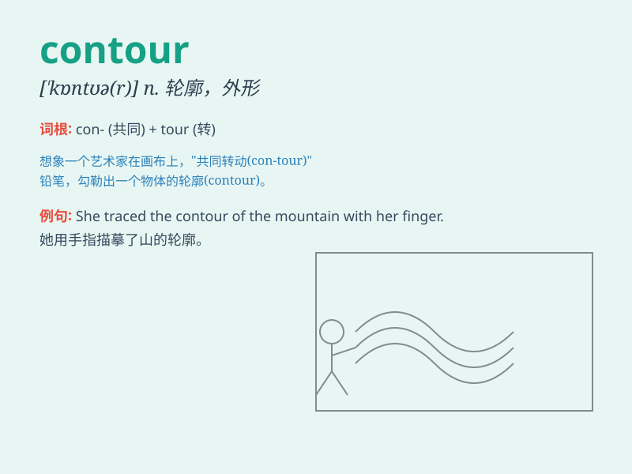

## contour

**英音:** _[\'kɒntʊə]_ **美音:** _[\'kɑntʊr]_

**译义:** *n.轮廓,周线,等高线*

### 短语

+ **contour line:** _等高线；轮廓线_

+ **contour map:** _等高线图；轮廓图_

+ **facial contour:** _面部轮廓_

+ **body contour:** _身体轮廓_

+ **contour feather:** _轮廓羽毛_

### 例句

#### 例句1

> **The contour of the mountain is very beautiful at sunset.**

**中文翻译:** 在日落时分，山的轮廓非常美丽。

**单词释义:** 轮廓

#### 例句2

> **She carefully traced the contour of his face with her
fingers.**

**中文翻译:** 她用手指仔细地描绘他脸部的轮廓。

**单词释义:** 轮廓

#### 例句3

> **The dress was designed to follow the natural contour of the
body.**

**中文翻译:** 这件连衣裙的设计是为了贴合身体的自然轮廓。

**单词释义:** 轮廓；外形

### 背诵小故事

>
想象一下，你在森林中迷路了，只能依靠地图上的线条（contour）来找到出路。这些线条清晰地勾勒出山脉和河流的轮廓，引导你走向安全的地方。

**想象你在森林中依靠地图上表示轮廓的线条'contour'走出迷路困境。**

### 图义

