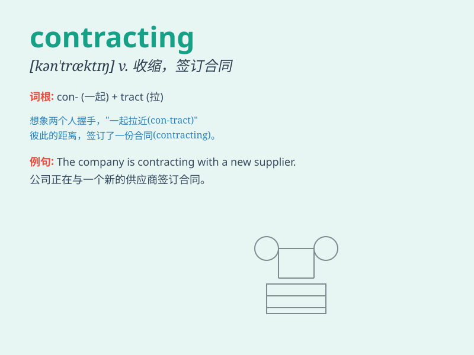

## contracting

**英音:** _[kən\'træktɪŋ]_ **美音:** _[kən\'træktɪŋ]_

**译义:** *adj. 收缩的；缩小的；收缩中的

vt. 使缩短；使收缩（contract的ing形式）

vi\. 收缩；缩小（contract的ing形式）*

### 短语

+ **contracting party:** _缔约方；订约方；合同当事人_

+ **contracting business:** _承包业务；合同业务_

+ **contracting authority:** _订约当局；缔约当局_

+ **contracting market:** _收缩市场；萎缩的市场_

+ **contracting process:** _缔约过程；合同签订过程_

### 例句

#### 例句1

> **The company is contracting its business operations to cut
costs.**

**中文翻译:** 这家公司正在收缩其业务运营以削减成本。

**单词释义:** 收缩

#### 例句2

> **He was diagnosed with a disease that causes the muscles to keep
contracting.**

**中文翻译:** 他被诊断出患有一种导致肌肉持续收缩的疾病。

**单词释义:** 收缩

#### 例句3

> **The economy is contracting, leading to higher unemployment.**

**中文翻译:** 经济正在萎缩，导致失业率上升。

**单词释义:** 萎缩

### 背诵小故事

> A company was contracting with many small suppliers. But the process
was full of difficulties. Finally, they found a better way to manage the
contracting and made a big success.

**一家公司正在与许多小供应商签订合同。但这个过程充满了困难。最后，他们找到了管理合同签订的更好方法，并取得了巨大成功。**

### 图义

