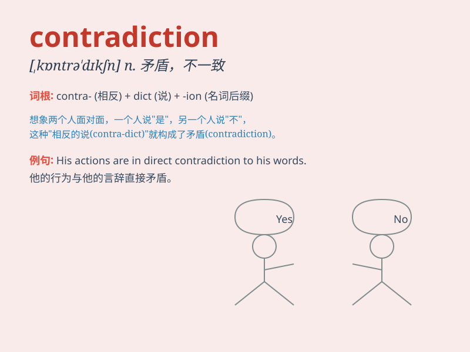

## contradiction

**英音:** _[kɒntrə\'dɪkʃ(ə)n]_ **美音:**
_[,kɑntrə\'dɪkʃən]_

**译义:** *n.反驳,矛盾*

### 短语

+ **in contradiction to:** _与\...相矛盾_

+ **contradiction between:** _在\...之间的矛盾_

+ **resolve a contradiction:** _解决一个矛盾_

+ **internal contradiction:** _内部矛盾_

+ **logical contradiction:** _逻辑矛盾_

### 例句

#### 例句1

> **There is a contradiction between his words and actions.**

**中文翻译:** 他的言行之间存在矛盾。

**单词释义:** 矛盾；不一致

#### 例句2

> **The new policy seems to be in contradiction to the previous
one.**

**中文翻译:** 新政策似乎与之前的政策相矛盾。

**单词释义:** 矛盾；抵触

#### 例句3

> **Her statement contains many contradictions.**

**中文翻译:** 她的陈述包含许多矛盾之处。

**单词释义:** 矛盾；自相矛盾

### 背诵小故事

> A brave knight always claimed to be fearless. But one day, when
facing a tiny spider, he trembled. This was a clear contradiction. His
words and actions didn\'t match.

**一位勇敢的骑士总是声称自己无所畏惧。但有一天，面对一只小蜘蛛时，他却颤抖了。这是一个明显的矛盾。他的言语和行动不相符。**

### 图义

