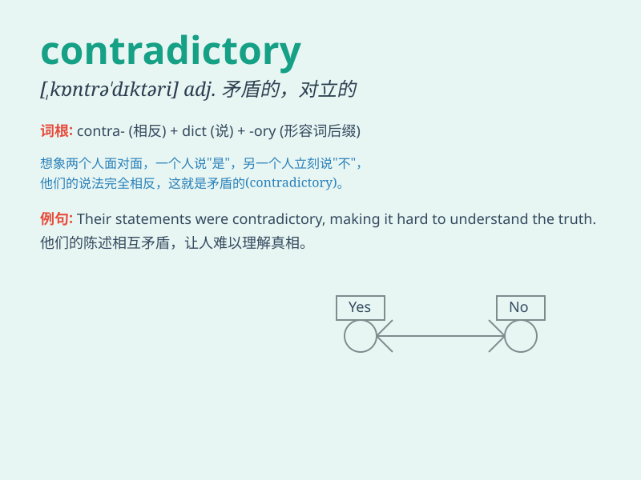

## contradictory

**英音:** _[kɒntrə\'dɪkt(ə)rɪ]_ **美音:**
_[,kɑntrə\'dɪktəri]_

**译义:** *adj.反驳的,反对的,抗辩的n.矛盾因素,对立物*

### 短语

+ **contradictory statements:** _自相矛盾的陈述_

+ **contradictory evidence:** _相互矛盾的证据_

+ **be contradictory to:** _与\...\...相矛盾_

+ **contradictory opinions:** _对立的观点_

+ **find something contradictory:** _发现某物相互矛盾_

### 例句

#### 例句1

> **His statements are often contradictory and confusing.**

**中文翻译:** 他的陈述经常自相矛盾且令人困惑。

**单词释义:** 自相矛盾的

#### 例句2

> **The two reports present contradictory evidence.**

**中文翻译:** 这两份报告提供了相互矛盾的证据。

**单词释义:** 相互矛盾的

#### 例句3

> **Her behavior was contradictory to what she had promised.**

**中文翻译:** 她的行为与她所承诺的相矛盾。

**单词释义:** 与\...\...相矛盾的

### 背诵小故事

> A detective was solving a case. One witness said the thief was tall,
but another said short. These contradictory statements made the
detective confused. Finally, he found the truth.

**一位侦探在破案。一个证人说小偷个子高，另一个却说矮。这些相互矛盾的陈述让侦探感到困惑。最终，他找到了真相。**

### 图义

