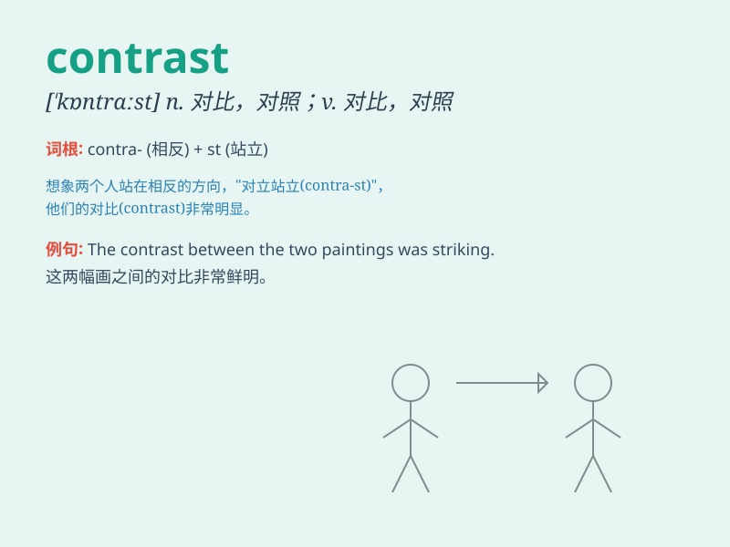

## contrast

**英音:** _[\'kɒntrɑːst]_ **美音:** _[\'kɑntræst]_

**译义:**
*vt.使与\...对比,使与\...对照vi.和\...形成对照n.对比,对照,(对照中的)差异*

### 短语

+ **in contrast:** _相比之下_

+ **contrast with:** _与\...\...形成对比_

+ **by contrast:** _对比之下；相反_

+ **contrast sharply:** _形成鲜明的对比_

+ **contrast between:** _\...\...之间的对比_

### 例句

#### 例句1

> **The contrast between the two paintings is striking.**

**中文翻译:** 这两幅画之间的对比是惊人的。

**单词释义:** 对比；对照

#### 例句2

> **In contrast to her sister, she is very tall.**

**中文翻译:** 与她妹妹相比，她非常高。

**单词释义:** 与......形成对比

#### 例句3

> **The white walls provide a sharp contrast to the black
furniture.**

**中文翻译:** 白色的墙壁与黑色的家具形成了鲜明的对比。

**单词释义:** 对比；反差

### 背诵小故事

>
在一个黑暗的房间里，有一幅白色的画挂在黑色的墙上，形成鲜明的contrast。白色的画就像光明，黑色的墙如同黑暗，两者的差异让人一眼就能看出，这就是contrast的体现。

**在一个黑暗的房间里，有一幅白色的画挂在黑色的墙上，形成鲜明的对比。白色的画就像光明，黑色的墙如同黑暗，两者的差异让人一眼就能看出，这就是对比的体现。**

### 图义

