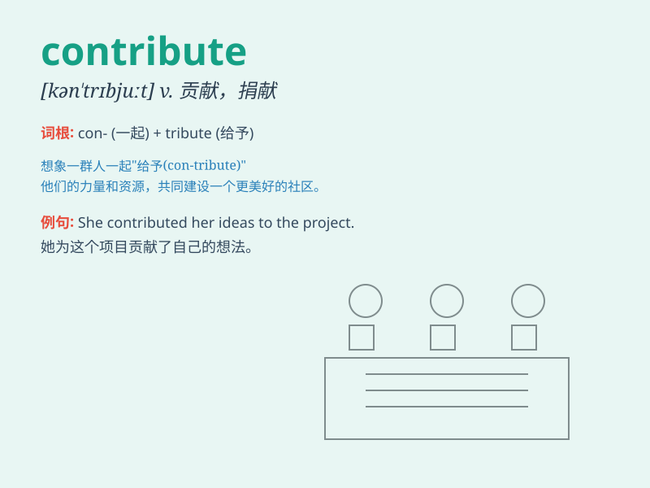

## contribute

**英音:** _[kən\'trɪbjuːt; \'kɒntrɪbjuːt]_ **美音:**
_[kən\'trɪbjut]_

**译义:** *v.捐助,捐献,贡献,投稿*

### 短语

+ **contribute to:** _有助于；促成；捐献_

+ **contribute funds:** _捐款_

+ **contribute effort:** _贡献力量_

+ **contribute ideas:** _贡献想法_

+ **contribute articles:** _投稿_

### 例句

#### 例句1

> **Everyone is encouraged to contribute to the charity event.**

**中文翻译:** 每个人都被鼓励为慈善活动做出贡献。

**单词释义:** 贡献

#### 例句2

> **His research contributes significantly to the field of
medicine.**

**中文翻译:** 他的研究对医学领域有重大贡献。

**单词释义:** 有助于

#### 例句3

> **She contributes articles to the local newspaper regularly.**

**中文翻译:** 她定期给当地报纸投稿。

**单词释义:** 投稿；撰稿

### 背诵小故事

> A group of friends decided to organize a charity event. Everyone
contributed their time and effort. Some prepared food, some decorated
the venue. Their contributions made the event a huge success.

**一群朋友决定组织一场慈善活动。每个人都贡献了他们的时间和精力。一些人准备食物，一些人布置场地。他们的贡献使得活动取得了巨大成功。**

### 图义

