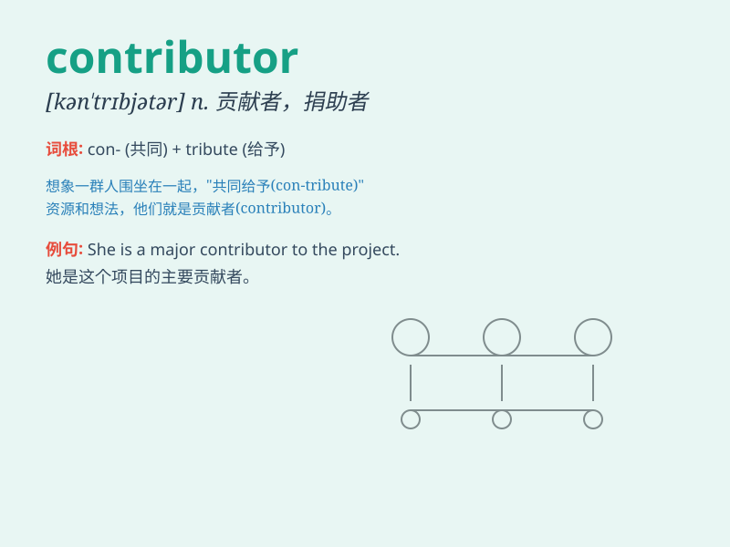

## contributor

**英音:** _[kən\'trɪbjʊtə]_ **美音:** _[kən\'trɪbjətɚ]_

**译义:** *n.贡献者,捐助者,投稿者*

### 短语

+ **major contributor:** _主要贡献者_

+ **contributor factor:** _促成因素_

+ **key contributor:** _关键贡献者_

+ **significant contributor:** _重要贡献者_

+ **leading contributor:** _领先的贡献者_

### 例句

#### 例句1

> **She is a major contributor to the charity organization.**

**中文翻译:** 她是这个慈善组织的主要捐赠者。

**单词释义:** 捐赠者；作出贡献者

#### 例句2

> **The new policy has many contributors, but he is the most
influential one.**

**中文翻译:** 这项新政策有很多促成者，但他是最有影响力的一位。

**单词释义:** 促成者；起作用的因素

#### 例句3

> **The book has several contributors, each specializing in a
different field.**

**中文翻译:** 这本书有几位撰稿人，每个人都专长于不同的领域。

**单词释义:** 撰稿人；投稿人

### 背诵小故事

> In a big project, many people were working hard. One of them was Tom.
He provided many good ideas and efforts. Tom was a contributor. His
contributions made the project successful.

**在一个大项目中，很多人都在努力工作。其中有一个叫汤姆的，他提供了很多好点子和付出了很多努力。汤姆就是一个贡献者。他的贡献让这个项目取得了成功。**

### 图义

