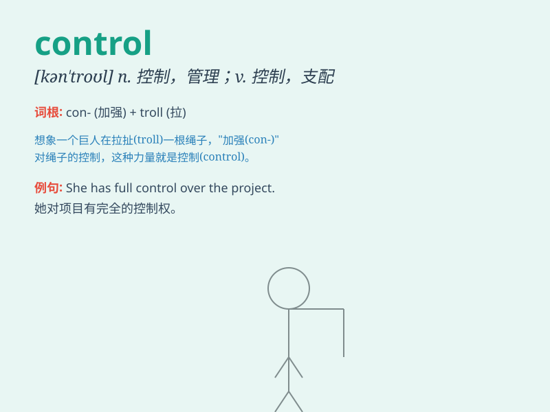

## control

**英音:** _[kən\'trəʊl]_ **美音:** _[kən\'trol]_

**译义:**
*n.控制,支配,管理,调节,抑制,控制器,调节装置vt.控制,支配,管理(物价等),操纵,抑制*

### 短语

+ **out of control:** _失去控制；不受控制_

+ **under control:** _处于控制之下；得到控制_

+ **control oneself:** _控制自己；自制_

+ **quality control:** _质量控制；质量管理_

+ **cost control:** _成本控制_

### 例句

#### 例句1

> **The government is trying to control inflation.**

**中文翻译:** 政府正在努力控制通货膨胀。

**单词释义:** 控制；抑制

#### 例句2

> **She lost control of her car on the ice.**

**中文翻译:** 她在冰面上失去了对汽车的控制。

**单词释义:** 控制；掌控

#### 例句3

> **The remote control doesn\'t work.**

**中文翻译:** 这个遥控器坏了。

**单词释义:** 遥控器

### 背诵小故事

> A brave pilot was in control of a shaky plane. Despite strong winds
and technical issues, he remained calm and used his skills to control
the situation and land safely.

**一位勇敢的飞行员掌控着一架摇晃的飞机。尽管有强风和技术问题，他仍保持冷静，运用他的技能控制住局面并安全着陆。**

### 图义

