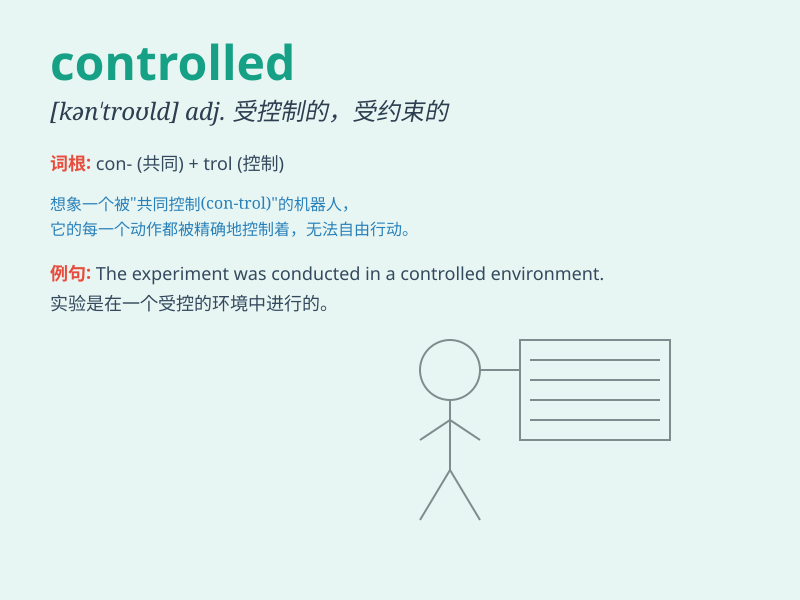

## controlled

**英音:** _[kən\'trəʊld]_ **美音:** _[kən\'trold]_

**译义:** *adj.受约束的,克制的*

### 短语

+ **controlled experiment:** _对照实验_

+ **controlled substance:** _受管制物质_

+ **controlled environment:** _受控环境_

+ **controlled release:** _控制释放；控释_

+ **controlled fire:** _控制火势_

### 例句

#### 例句1

> **The experiment was carried out in a controlled environment.**

**中文翻译:** 这个实验是在一个受控制的环境中进行的。

**单词释义:** 受控制的

#### 例句2

> **She controlled her emotions and remained calm.**

**中文翻译:** 她控制住自己的情绪，保持冷静。

**单词释义:** 控制；克制

#### 例句3

> **The disease is now under controlled.**

**中文翻译:** 这种疾病现在已得到控制。

**单词释义:** 被控制；处于控制之下

### 背诵小故事

> A brave scientist controlled a dangerous virus in the lab. He was
very careful and precise. With his control, the threat was finally
managed. Remember, \'controlled\' means managed or directed with care.

**一位勇敢的科学家在实验室控制住了一种危险的病毒。他非常小心且精准。在他的控制下，威胁最终被化解。记住，\'controlled\'意思是小心地管理或指挥。**

### 图义

