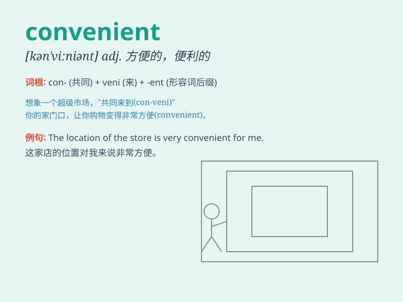

## convenient

**英音:** _[kən\'viːnɪənt]_ **美音:** _[kənˈvinjənt]_

**译义:** *adj.便利的,方便的*

### 短语

+ **be convenient for:** _对\...\...方便_

+ **convenient store:** _便利店_

+ **convenient time:** _方便的时间_

+ **convenient location:** _便利的位置_

+ **convenient transportation:** _便捷的交通_

### 例句

#### 例句1

> **The supermarket is very convenient for us to buy groceries.**

**中文翻译:** 这家超市对于我们购买食品杂货非常方便。

**单词释义:** 方便的；便利的

#### 例句2

> **It is convenient to take the subway to work during rush hour.**

**中文翻译:** 在高峰时段乘地铁去上班很方便。

**单词释义:** 方便的；便利的

#### 例句3

> **This new app is extremely convenient for online shopping.**

**中文翻译:** 这个新的应用程序对于网上购物极其方便。

**单词释义:** 方便的；便利的

### 背诵小故事

> One day, I was in a hurry to go to work. Luckily, there was a
convenient bus stop right near my house. I quickly got on the bus and
reached my office on time. Convenient means easy and suitable for you.

**有一天，我急着去上班。幸运的是，我家附近正好有个便利的公交站。我很快上了车并准时到了办公室。convenient
意思是方便的、便利的。**

### 图义

