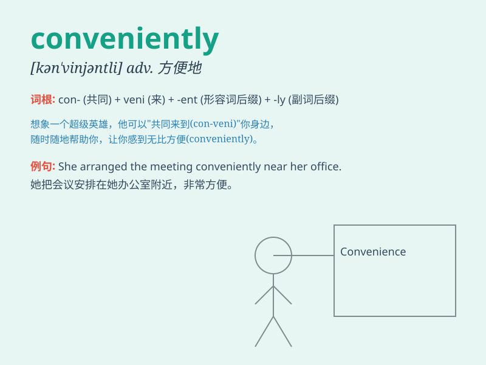

## conveniently

**英音:** _[kən\'viːniəntli]_ **美音:**
_[kən\'viniəntli]_

**译义:** *adv.便利地*

### 短语

+ **conveniently located:** _位置便利_

+ **conveniently accessible:** _方便到达_

+ **conveniently timed:** _时间安排方便_

+ **conveniently packaged:** _包装方便_

+ **conveniently placed:** _放置方便_

### 例句

#### 例句1

> **The hotel is conveniently located near the train station.**

**中文翻译:** 这家酒店位置便利，靠近火车站。

**单词释义:** 便利地；方便地

#### 例句2

> **You can conveniently pay by credit card.**

**中文翻译:** 你可以方便地用信用卡支付。

**单词释义:** 方便地；便利地

#### 例句3

> **The new shopping mall is conveniently accessible by public
transport.**

**中文翻译:** 新的购物中心乘坐公共交通便利可达。

**单词释义:** 便利地；方便地

### 背诵小故事

> One day, I was lost in a strange city. Fortunately, I found a hotel
conveniently located near the main street. It made my stay much easier
and comfortable.

**有一天，我在一个陌生的城市迷路了。幸运的是，我方便地找到了一家位于主街附近的酒店。这让我的停留变得容易和舒适多了。**

### 图义

