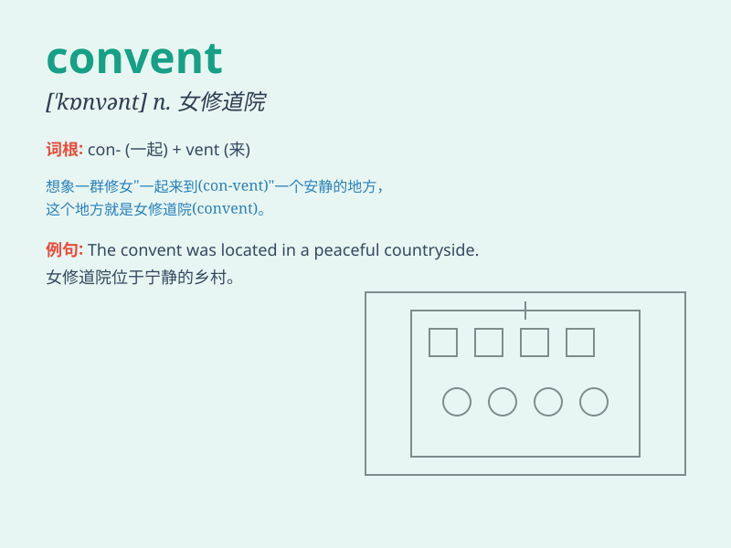

## convent

**英音:** _[\'kɒnv(ə)nt]_ **美音:** _[\'kɑnvɛnt]_

**译义:** *n.女修道会,女修道院*

### 短语

+ **convent school:** _女修道院学校_

+ **convent garden:** _考文特花园（伦敦的一个地区）_

+ **enter a convent:** _进入女修道院_

+ **leave the convent:** _离开女修道院_

+ **convent life:** _修道院生活_

### 例句

#### 例句1

> **She entered the convent at a young age.**

**中文翻译:** 她在年轻时就进入了女修道院。

**单词释义:** 女修道院

#### 例句2

> **The convent was a peaceful place away from the chaos of the
city.**

**中文翻译:** 这座女修道院是一个远离城市喧嚣的宁静之地。

**单词释义:** 女修道院

#### 例句3

> **The nuns in the convent spent their days in prayer and
service.**

**中文翻译:** 女修道院里的修女们在祈祷和服务中度过她们的日子。

**单词释义:** 女修道院

### 背诵小故事

> A girl named Lily was lost in a big city. One day, she found a
convent and was taken in by kind nuns. The convent became her peaceful
home. It was a place of safety and love.

**一个叫莉莉的女孩在大城市里迷路了。有一天，她发现了一个女修道院，善良的修女收留了她。女修道院成了她宁静的家，是一个充满安全和爱的地方。**

### 图义

