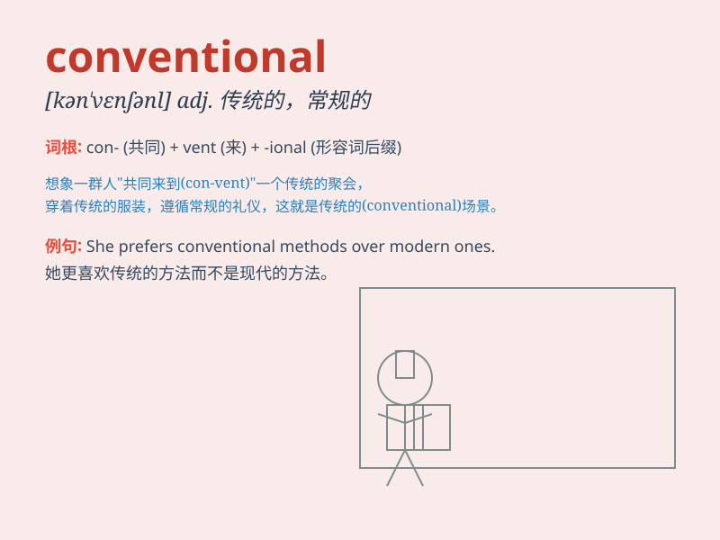

## conventional

**英音:** _[kən\'venʃ(ə)n(ə)l]_ **美音:**
_[kən\'vɛnʃənl]_

**译义:** *adj.惯例的,常规的,习俗的,传统的*

### 短语

+ **conventional wisdom:** _传统观点；世俗认知_

+ **conventional method:** _常规方法_

+ **conventional weapons:** _常规武器_

+ **conventional forces:** _常规部队_

+ **conventional style:** _传统风格_

### 例句

#### 例句1

> **Conventional methods of teaching are still widely used.**

**中文翻译:** 传统的教学方法仍然被广泛使用。

**单词释义:** 传统的

#### 例句2

> **He has a very conventional way of thinking.**

**中文翻译:** 他的思维方式非常传统。

**单词释义:** 传统的

#### 例句3

> **The conventional wisdom is that hard work leads to success.**

**中文翻译:** 传统的观点认为努力工作会通向成功。

**单词释义:** 传统的

### 背诵小故事

> A young inventor refused to follow conventional ways. He created a
unique flying machine that shocked the world. His unconventional
thinking made him famous. \'Conventional\' means following accepted
standards or usual ways.

**一位年轻的发明家拒绝遵循传统方式。他创造了一架独特的飞行器震惊了世界。他非传统的思维使他出名。\'conventional\'意思是遵循公认的标准或通常的方式。**

### 图义

