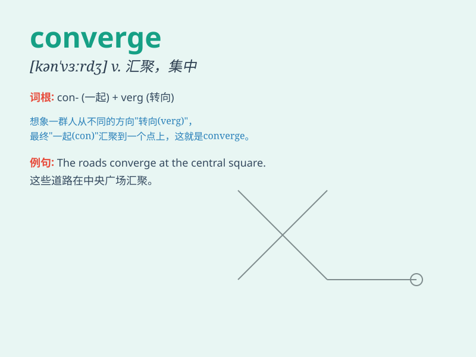

## converge

**英音:** _[kən\'vɜːdʒ]_ **美音:** _[kən\'vɝdʒ]_

**译义:** *v.聚合,集中于一点vt.会聚*

### 短语

+ **converge on:** _集中于；向......聚拢_

+ **converge towards:** _朝......汇聚_

+ **converge with:** _与......汇合；与......趋于一致_

+ **lines converge:** _线条汇聚_

+ **ideas converge:** _想法趋于一致_

### 例句

#### 例句1

> **The roads converge at the town centre.**

**中文翻译:** 这些道路在城镇中心交汇。

**单词释义:** 交汇；会合

#### 例句2

> **People from different backgrounds converge in this city.**

**中文翻译:** 来自不同背景的人们汇聚在这个城市。

**单词释义:** 汇聚；聚集

#### 例句3

> **The two rivers converge to form a larger one.**

**中文翻译:** 这两条河汇合成一条更大的河。

**单词释义:** 汇合成

### 背诵小故事

>
想象在一个神秘的森林中，有许多小路。一天，来自不同方向的小动物们都沿着各自的小路前行，最终它们都走到了森林的中心，这个过程就是\'converge\'（汇聚、集中）。

**想象在一个神秘森林中，不同方向的小动物最终都走到森林中心的过程就是\'汇聚、集中\'**

### 图义

