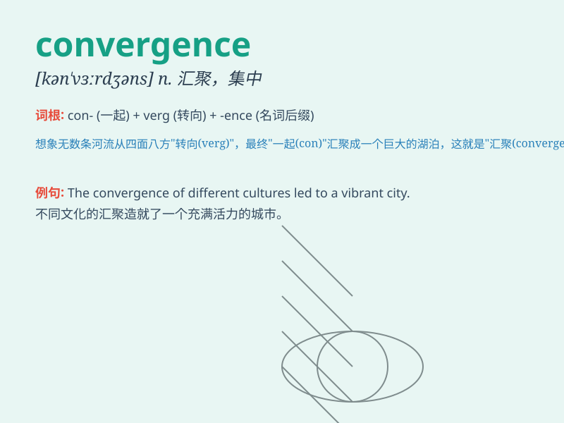

## convergence

**英音:** _[kən\'vɜːdʒəns]_ **美音:** _[kən\'vɝdʒəns]_

**译义:** *n.集中,收敛*

### 短语

+ **convergence zone:** _会聚区；辐合带_

+ **convergence theory:** _趋同理论_

+ **rate of convergence:** _收敛速度；会聚速度_

+ **convergence criterion:** _收敛准则；收敛判据_

+ **convergence test:** _收敛性检验；收敛测试_

### 例句

#### 例句1

> **The convergence of different cultures leads to a rich and diverse
society.**

**中文翻译:** 不同文化的汇聚造就了一个丰富多样的社会。

**单词释义:** 汇聚；集合

#### 例句2

> **There is a convergence of opinions among the experts on this
issue.**

**中文翻译:** 在这个问题上，专家们的意见趋于一致。

**单词释义:** 趋于一致；汇集

#### 例句3

> **The convergence of technology and design has created amazing
products.**

**中文翻译:** 技术与设计的融合创造了令人惊叹的产品。

**单词释义:** 融合；会合

### 背诵小故事

> Imagine a group of people from different directions all walking
towards a central point. This movement towards the same place is like
\'convergence\'. It shows how things come together or meet at one point.

**想象一群人从不同的方向都走向一个中心点。这种朝着同一个地方的移动就像是\'convergence\'。它展示了事物如何聚集或汇聚在一个点上。**

### 图义

