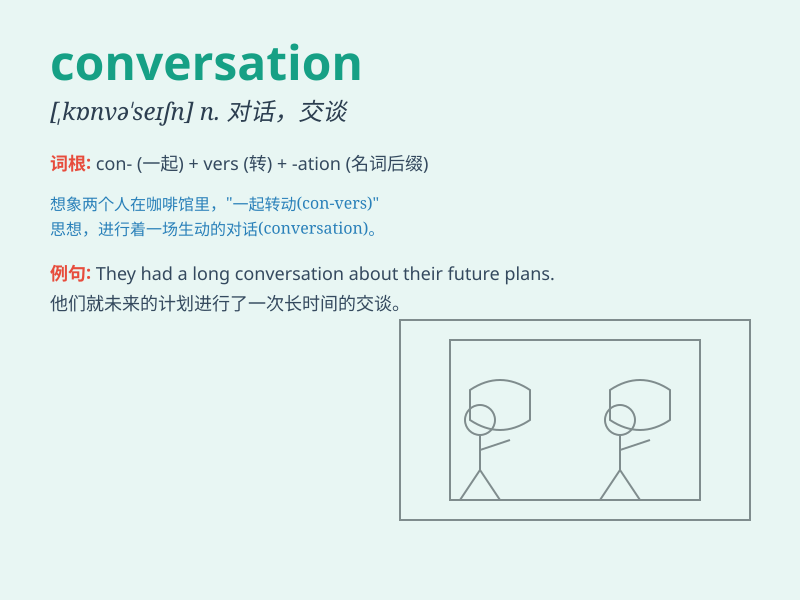

## conversation

**英音:** _[kɒnvə\'seɪʃ(ə)n]_ **美音:**
_[,kɑnvɚ\'seʃən]_

**译义:** *n.会话,交谈*

### 短语

+ **have a conversation:** _进行一次谈话_

+ **carry on a conversation:** _继续谈话_

+ **start a conversation:** _开始谈话_

+ **end a conversation:** _结束谈话_

+ **make conversation:** _找话谈；没话找话_

### 例句

#### 例句1

> **I had a pleasant conversation with my neighbor yesterday.**

**中文翻译:** 昨天我和我的邻居进行了一次愉快的交谈。

**单词释义:** 交谈；谈话

#### 例句2

> **Their conversation turned to the topic of travel.**

**中文翻译:** 他们的谈话转向了旅行这个话题。

**单词释义:** 谈话；交流

#### 例句3

> **We need to have a serious conversation about your future.**

**中文翻译:** 我们需要就你的未来进行一次严肃的谈话。

**单词释义:** 对话；交流

### 背诵小故事

> One day, Tom and Jerry had a long conversation. They talked about
their adventures and shared funny stories. Through this chat, they
understood each other better.

**有一天，汤姆和杰瑞进行了一次长谈。他们谈论了各自的冒险经历，分享了有趣的故事。通过这次聊天，他们更加了解彼此了。**

### 图义

