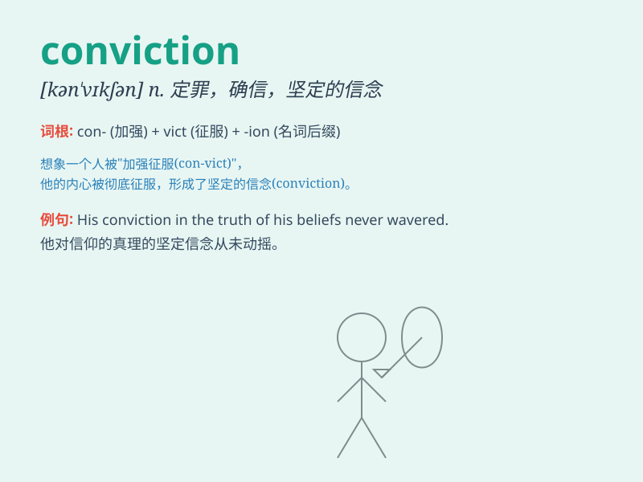

## conviction

**英音:** _[kən\'vɪkʃ(ə)n]_ **美音:** _[kən\'vɪkʃən]_

**译义:** *n.深信,确信,定罪,宣告有罪*

### 短语

+ **strong conviction:** _坚定的信念_

+ **moral conviction:** _道德信念_

+ **conviction for crime:** _犯罪定罪_

+ **personal conviction:** _个人信念_

+ **deep conviction:** _深深的信念_

### 例句

#### 例句1

> **His conviction for fraud led to a lengthy prison sentence.**

**中文翻译:** 他因欺诈罪被定罪，导致被判长期监禁。

**单词释义:** 定罪；判罪

#### 例句2

> **She spoke with great conviction about the need for change.**

**中文翻译:** 她满怀信念地谈到变革的必要性。

**单词释义:** 坚定的信念；深信

#### 例句3

> **The politician\'s conviction that taxes should be lowered was
popular among voters.**

**中文翻译:** 这位政治家认为应该降低税收的信念在选民中很受欢迎。

**单词释义:** 坚定的看法；确信

### 背诵小故事

> A thief was caught stealing. Despite all the evidence, he stubbornly
denied it. But the detective\'s firm CONVICTION that he was guilty led
to a thorough investigation and finally the truth came out. The thief
was convicted.

**一个小偷被抓到偷窃。尽管证据确凿，他仍顽固否认。但侦探坚信他有罪的信念促使进行深入调查，最终真相大白。小偷被定罪了。**

### 图义

