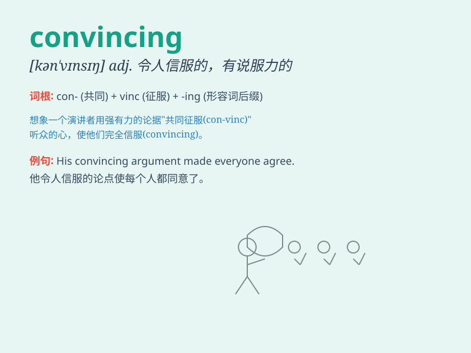

## convincing

**英音:** _[kən\'vɪnsɪŋ]_ **美音:** _[kən\'vɪnsɪŋ]_

**译义:** *adj.令人信服的,有力的,令人心悦诚服的*

### 短语

+ **convincing evidence:** _令人信服的证据_

+ **convincing argument:** _有说服力的论点_

+ **convincing performance:** _令人信服的表现_

+ **convincing victory:** _令人信服的胜利_

+ **convincing story:** _令人信服的故事_

### 例句

#### 例句1

> **Her argument was very convincing and everyone agreed with
her.**

**中文翻译:** 她的论点非常有说服力，每个人都同意她的观点。

**单词释义:** 有说服力的

#### 例句2

> **The evidence presented was so convincing that the jury reached a
verdict quickly.**

**中文翻译:** 所出示的证据如此有说服力，以至于陪审团很快做出了裁决。

**单词释义:** 令人信服的

#### 例句3

> **He gave a convincing performance and won the award.**

**中文翻译:** 他给出了令人信服的表现并赢得了奖项。

**单词释义:** 令人信服的

### 背诵小故事

> One day, a salesman gave a very convincing speech about a new
product. Everyone in the room was completely persuaded and wanted to buy
it. His words were so powerful and made people believe without doubt.

**一天，一位销售员就一款新产品发表了一场极具说服力的演讲。房间里的每个人都完全被说服了，都想买。他的话太有力量了，让人毫无疑问地相信。**

### 图义

