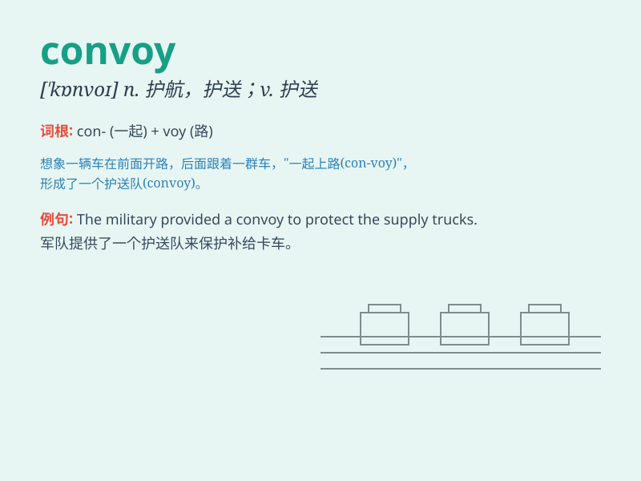

## convoy

**英音:** _[\'kɒnvɒɪ]_ **美音:** _[\'kɑnvɔɪ]_

**译义:** *n.护送,护卫vt.护航,护送*

### 短语

+ **convoy escort:** _护航队护送_

+ **convoy of ships:** _船队_

+ **military convoy:** _军事护航队_

+ **convoy protection:** _护航保护_

+ **supply convoy:** _补给护航队_

### 例句

#### 例句1

> **The convoy of trucks carried essential supplies to the disaster
area.**

**中文翻译:** 卡车车队将必需品运往灾区。

**单词释义:** 车队

#### 例句2

> **The military convoy was protected by armed soldiers.**

**中文翻译:** 这支军事护送队由武装士兵保护。

**单词释义:** 护送队

#### 例句3

> **The ships formed a convoy for safety during the storm.**

**中文翻译:** 这些船只在风暴期间组成了护航队以求安全。

**单词释义:** 护航队

### 背诵小故事

> A group of ships was sailing in the vast ocean. They were in danger
of being attacked by pirates. Luckily, a team of warships came to
protect them. This team of warships is called a convoy.

**一组船只在广阔的海洋中航行。它们面临着被海盗袭击的危险。幸运的是，一队军舰前来保护它们。这队军舰就被称为护航队。**

### 图义

