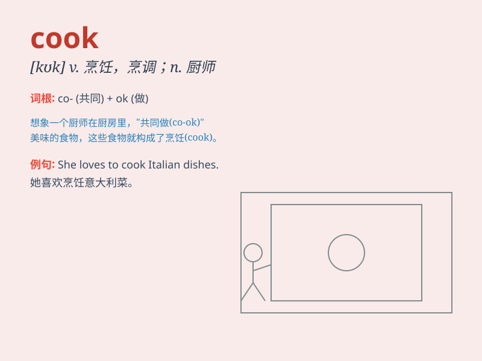

## cook

**英音:** _[kʊk]_ **美音:** _[kʊk]_

**译义:** *n.厨师v.烹调,煮,伪造*

### 短语

+ **cook a meal:** _做饭_

+ **cook up:** _编造；策划_

+ **cook the books:** _做假账_

+ **cook something from scratch:** _从头开始做某物_

+ **slow cook:** _慢炖；小火煮_

### 例句

#### 例句1

> **My mother is a good cook.**

**中文翻译:** 我的母亲是一位好厨师。

**单词释义:** 厨师

#### 例句2

> **I need to cook dinner for my family.**

**中文翻译:** 我需要为我的家人做晚餐。

**单词释义:** 烹饪，做饭

#### 例句3

> **The fish is still raw. It needs more cooking.**

**中文翻译:** 这鱼还是生的。它需要更多的烹饪。

**单词释义:** 烹饪，煮

### 背诵小故事

> One day, Tom was very hungry. So he decided to cook some delicious
food. He put the ingredients in the pot and waited patiently. Finally,
the meal was ready and he enjoyed it a lot.

**有一天，汤姆非常饿。所以他决定烹饪一些美味的食物。他把食材放进锅里然后耐心等待。最后，饭菜做好了，他吃得很开心。**

### 图义

